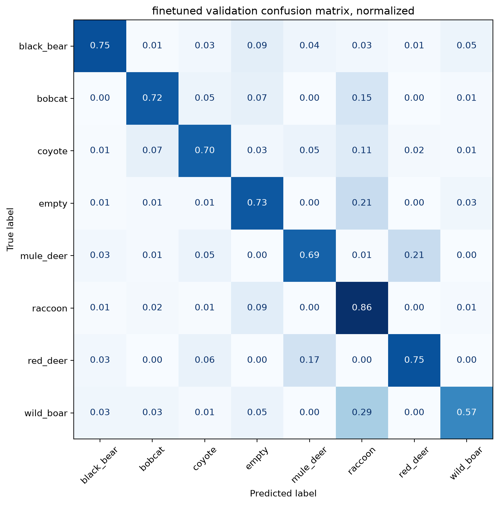
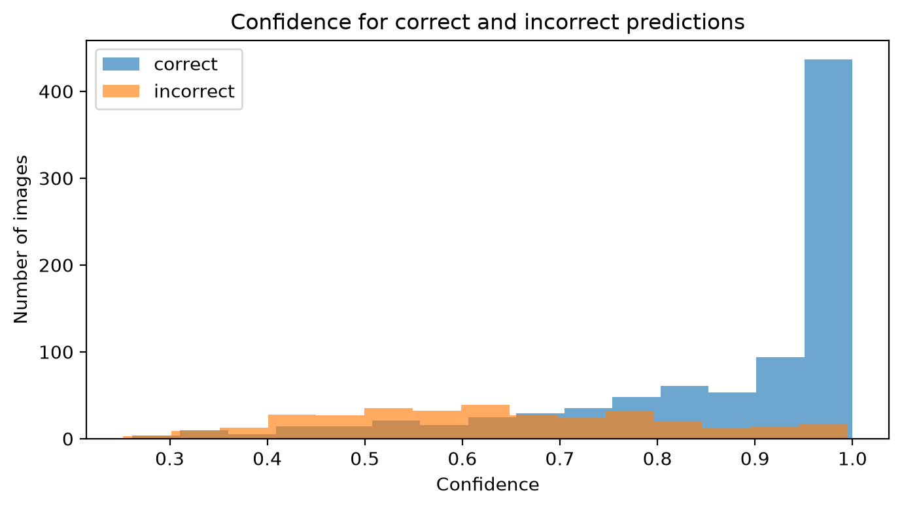

# Wildlife Image Classification from Camera-Trap Images

This project builds an 8-class wildlife classifier from camera-trap images. The current public version is meant to tell the story through the first four notebooks: dataset preparation, classical baselines, transfer learning, and error analysis with visual explanations.

The short version: simple image features work, but transfer learning works much better. A fine-tuned MobileNetV2 is the strongest model so far, reaching about 72-73% validation accuracy on a balanced 1,200-image validation set. The remaining errors are not random: they concentrate in low-light scenes, small or partially visible animals, empty-vs-animal ambiguity, and visually similar species.

## Results so far

| Stage | Model / diagnostic | Validation result |
|---|---|---:|
| Baseline | Majority class | 0.1250 accuracy / 0.0278 macro-F1 |
| Classical CV | Resized pixels + Logistic Regression | 0.4958 accuracy / 0.4961 macro-F1 |
| Classical CV | HOG + Linear SVM | 0.4250 accuracy / 0.4260 macro-F1 |
| Classical CV | HOG + color histograms + Linear SVM | 0.4425 accuracy / 0.4443 macro-F1 |
| Deep learning | Small CNN from scratch | 0.4467 accuracy |
| Transfer learning | Frozen MobileNetV2 | 0.7000 accuracy / 0.7014 macro-F1 |
| Transfer learning | Fine-tuned MobileNetV2, notebook 03 run | 0.7317 accuracy / 0.7341 macro-F1 |
| Error-analysis snapshot | Fine-tuned MobileNetV2, notebook 04 saved model | 0.7217 accuracy / 0.7249 macro-F1 |
| Binary check | Empty vs non-empty | 0.9242 accuracy |

The validation set has 1,200 images: 150 per class. The 0.7317 result is the best training-notebook result currently recorded; the 0.7217 result is the saved-model snapshot used for the deeper error analysis. That small mismatch should be resolved before a final test-set claim, but both numbers point to the same conclusion: MobileNetV2 transfer learning is the first strong model in this project.

## What the model is getting right and wrong

The model is strongest on `black_bear`, `raccoon`, and `red_deer`, and weakest on `wild_boar`, `bobcat`, and some `empty` images. The largest repeated confusion pairs in the saved-model analysis are:

| True label | Predicted label | Count |
|---|---|---:|
| `wild_boar` | `raccoon` | 44 |
| `mule_deer` | `red_deer` | 31 |
| `empty` | `raccoon` | 31 |
| `red_deer` | `mule_deer` | 25 |
| `bobcat` | `raccoon` | 22 |

The normalized confusion matrix makes the pattern visible: deer species are often swapped, `wild_boar` is frequently absorbed into `raccoon`, and a meaningful share of empty frames are predicted as animal classes.



Some high-confidence mistakes are understandable even by eye: animals are tiny, at the edge of the frame, hidden in vegetation, badly lit, or visually close to another class.


Grad-CAM is useful here because it shows whether the model is looking at the animal or at background context. In several mistakes, the heatmap lands on plausible image regions, but not always on the truly class-defining part of the animal.


Confidence is informative but not perfect. Many correct predictions cluster at high confidence, yet the error-analysis notebook also finds confident wrong predictions, which is why manual auditing and localization are natural next steps.



## Dataset

The dataset is a local subset of the NACTI camera-trap dataset available through LILA BC. It contains 8 balanced classes with 1,000 images each:

| Class | Source label |
|---|---|
| `empty` | `empty` |
| `red_deer` | `cervus elaphus` |
| `wild_boar` | `sus scrofa` |
| `mule_deer` | `odocoileus hemionus` |
| `raccoon` | `procyon lotor` |
| `black_bear` | `ursus americanus` |
| `bobcat` | `lynx rufus` |
| `coyote` | `canis latrans` |

| Split | Images |
|---|---:|
| Train | 5,600 |
| Validation | 1,200 |
| Test | 1,200 |
| Total | 8,000 |

All selected images were verified to exist and open successfully. Cropped copies were created by removing 30 pixels from the top and bottom borders to reduce camera-trap timestamp/banner artifacts while keeping the original images unchanged.

## Notebook map

| Notebook | Purpose | Main output |
|---|---|---|
| `01_dataset_exploration.ipynb` | Build and verify the balanced dataset; create cropped image paths and stratified splits. | Clean metadata and train/val/test CSVs. |
| `02_classical_baselines.ipynb` | Establish non-deep-learning reference points. | Logistic Regression beats HOG-style features. |
| `03_deep_learning.ipynb` | Train a small CNN, frozen MobileNetV2, and fine-tuned MobileNetV2. | Fine-tuned MobileNetV2 is the best model so far. |
| `04_error_analysis_and_explainability.ipynb` | Inspect validation predictions, class-level metrics, confusion pairs, confidence, and Grad-CAM. | Concrete diagnosis of failure modes. |

## Current project diagnosis

The project is in a solid mid-stage: the data pipeline is working, the baseline hierarchy is clear, and the first transfer-learning model is meaningfully useful. The model is much better at detecting "animal vs no animal" than at always selecting the correct species.

The main risks before making a final claim are:

- The test set has intentionally not been used for a final reported score.
- Notebook 03 and notebook 04 currently report slightly different fine-tuned validation scores, likely because the saved model and the best training run are not perfectly aligned.
- Some predictions rely on background context, lighting, or camera-trap scene structure instead of clean animal evidence.
- The dataset is balanced by class for modeling, but real camera-trap deployments are usually not balanced.

## Future work

The next notebooks are good directions for turning this into a stronger wildlife-recognition system:

- Run MegaDetector on validation images and use detections to separate localization failures from species-classification failures.
- Add lighting diagnostics: preliminary local analysis suggests day/normal-light images are easier than grayscale/IR and night/low-light images.
- Use detector crops or detector confidence as model inputs, filters, or ensemble features.
- Audit high-confidence mistakes and likely label issues with a small manual review interface.
- Re-run the fine-tuning workflow with explicit checkpointing so the best validation model from notebook 03 is exactly the model analyzed in notebook 04.
- Try stronger backbones such as EfficientNet, ConvNeXt, or modern vision transformers after the MobileNetV2 baseline is stable.
- Evaluate once on the held-out test set only after the validation workflow is frozen.

## Repository structure

```text
wildlife-image-classification/
|-- README.md
|-- requirements.txt
|-- src/
|   `-- download_data.py
|-- data/
|   `-- metadata/
|       |-- subset_1000_per_class_clean.csv
|       |-- train_1000.csv
|       |-- val_1000.csv
|       `-- test_1000.csv
|-- notebooks/
|   |-- 01_dataset_exploration.ipynb
|   |-- 02_classical_baselines.ipynb
|   |-- 03_deep_learning.ipynb
|   `-- 04_error_analysis_and_explainability.ipynb
|-- reports/
|   |-- figures/
|   |-- error_analysis_class_summary.csv
|   `-- error_analysis_confusion_pairs.csv
`-- models/
```

Raw images, cropped images, and trained model files are local artifacts and are not intended to be committed.

## Setup

Install the standard dependencies:

```bash
pip install -r requirements.txt
```

The main workflow uses:

```text
numpy
pandas
matplotlib
pillow
tqdm
requests
scikit-learn
scikit-image
tensorflow
jupyter
```

On Apple Silicon, a separate TensorFlow-Metal environment can be useful for local training, but it is platform-specific and not required for reading the notebooks or reproducing the metadata workflow.
