# 03 - Deep Learning Models (1000 per class)

This notebook runs the same deep learning models for the wildlife camera-trap classification project on the enriched 1000-per-class dataset.

The goal is to test whether convolutional neural networks can learn more useful visual representations than the classical baselines from the previous notebook, using the same train, validation, and test split definitions for the larger dataset.

In this notebook, we will train and evaluate:

1. a small CNN trained from scratch;
2. a pretrained CNN used as a frozen feature extractor;
3. a fine-tuned pretrained CNN.

The main evaluation metrics will remain:

- validation accuracy;
- validation macro-F1;
- confusion matrices;
- visual inspection of misclassified examples.

The test set will be used only once, at the end, for the final selected model.


```python
import tensorflow as tf

print("TensorFlow:", tf.__version__)
print("Physical devices:")
for device in tf.config.list_physical_devices():
    print(device)

print("GPUs:")
print(tf.config.list_physical_devices("GPU"))
```

    TensorFlow: 2.18.1
    Physical devices:
    PhysicalDevice(name='/physical_device:CPU:0', device_type='CPU')
    PhysicalDevice(name='/physical_device:GPU:0', device_type='GPU')
    GPUs:
    [PhysicalDevice(name='/physical_device:GPU:0', device_type='GPU')]


## 1. Configuration


```python
from pathlib import Path
import sys
import random
import os

import numpy as np
import pandas as pd
import matplotlib.pyplot as plt

import tensorflow as tf
from tensorflow import keras
from tensorflow.keras import layers

from sklearn.metrics import (
    accuracy_score,
    f1_score,
    classification_report,
    confusion_matrix,
    ConfusionMatrixDisplay,
)

SEED = 42

random.seed(SEED)
np.random.seed(SEED)
tf.random.set_seed(SEED)

PROJECT_ROOT = Path.cwd()
if not (PROJECT_ROOT / "data").exists():
    PROJECT_ROOT = PROJECT_ROOT.parent

if str(PROJECT_ROOT.resolve()) not in sys.path:
    sys.path.append(str(PROJECT_ROOT.resolve()))

from src.download_data import READABLE_LABELS

DATA_DIR = PROJECT_ROOT / "data"
METADATA_DIR = DATA_DIR / "metadata"

TRAIN_CSV = METADATA_DIR / "train_1000.csv"
VAL_CSV = METADATA_DIR / "val_1000.csv"
TEST_CSV = METADATA_DIR / "test_1000.csv"

IMG_SIZE = (224, 224)
BATCH_SIZE = 32
AUTOTUNE = tf.data.AUTOTUNE

EPOCHS_SMALL_CNN = 15
EPOCHS_TRANSFER = 10

print("Configuration loaded.")
print(f"Project root: {PROJECT_ROOT.resolve()}")
print(f"Image size: {IMG_SIZE}")
print(f"Batch size: {BATCH_SIZE}")

```

    Configuration loaded.
    Project root: /Users/mihnea/Desktop/Proiecte personale/wildlife-image-classification
    Image size: (224, 224)
    Batch size: 32


## 2. Data loading


```python
train_df = pd.read_csv(TRAIN_CSV)
val_df = pd.read_csv(VAL_CSV)
test_df = pd.read_csv(TEST_CSV)

for df in [train_df, val_df, test_df]:
    df["readable_label"] = df["label"].map(READABLE_LABELS)

for name, df in {
    "train": train_df,
    "val": val_df,
    "test": test_df,
}.items():
    if df["readable_label"].isna().any():
        missing_labels = df.loc[df["readable_label"].isna(), "label"].unique()
        raise ValueError(f"{name} split has unmapped labels: {missing_labels}")

print(f"Train shape: {train_df.shape}")
print(f"Validation shape: {val_df.shape}")
print(f"Test shape: {test_df.shape}")

```

    Train shape: (5600, 17)
    Validation shape: (1200, 17)
    Test shape: (1200, 17)


```python
display(train_df.head())
```


<div>
<style scoped>
    .dataframe tbody tr th:only-of-type {
        vertical-align: middle;
    }

    .dataframe tbody tr th {
        vertical-align: top;
    }

    .dataframe thead th {
        text-align: right;
    }
</style>
<table border="1" class="dataframe">
  <thead>
    <tr style="text-align: right;">
      <th></th>
      <th>image_id</th>
      <th>file_name</th>
      <th>label</th>
      <th>category_id</th>
      <th>image_url</th>
      <th>local_path</th>
      <th>readable_label</th>
      <th>exists</th>
      <th>can_open</th>
      <th>width</th>
      <th>height</th>
      <th>cropped_path</th>
      <th>cropped_exists</th>
      <th>cropped_width</th>
      <th>cropped_height</th>
      <th>local_path_rel</th>
      <th>cropped_path_rel</th>
    </tr>
  </thead>
  <tbody>
    <tr>
      <th>0</th>
      <td>FL-32_05_03_2016_FL-32_0011551.JPG</td>
      <td>part2/sub267/FL-32_05_03_2016_FL-32_0011551.JPG</td>
      <td>canis latrans</td>
      <td>6</td>
      <td>https://storage.googleapis.com/public-datasets...</td>
      <td>/Users/mihnea/Desktop/Proiecte personale/wildl...</td>
      <td>coyote</td>
      <td>True</td>
      <td>True</td>
      <td>2048</td>
      <td>1536</td>
      <td>/Users/mihnea/Desktop/Proiecte personale/wildl...</td>
      <td>True</td>
      <td>2048</td>
      <td>1476</td>
      <td>data/raw/images/part2/sub267/FL-32_05_03_2016_...</td>
      <td>data/processed/cropped_images/part2/sub267/FL-...</td>
    </tr>
    <tr>
      <th>1</th>
      <td>CA-42_11_14_2015_CA-42_0012041.jpg</td>
      <td>part1/sub102/CA-42_11_14_2015_CA-42_0012041.jpg</td>
      <td>ursus americanus</td>
      <td>67</td>
      <td>https://storage.googleapis.com/public-datasets...</td>
      <td>/Users/mihnea/Desktop/Proiecte personale/wildl...</td>
      <td>black_bear</td>
      <td>True</td>
      <td>True</td>
      <td>2048</td>
      <td>1536</td>
      <td>/Users/mihnea/Desktop/Proiecte personale/wildl...</td>
      <td>True</td>
      <td>2048</td>
      <td>1476</td>
      <td>data/raw/images/part1/sub102/CA-42_11_14_2015_...</td>
      <td>data/processed/cropped_images/part1/sub102/CA-...</td>
    </tr>
    <tr>
      <th>2</th>
      <td>CA-13_10_05_2016_CA-13_0012363.JPG</td>
      <td>part0/sub048/CA-13_10_05_2016_CA-13_0012363.JPG</td>
      <td>ursus americanus</td>
      <td>67</td>
      <td>https://storage.googleapis.com/public-datasets...</td>
      <td>/Users/mihnea/Desktop/Proiecte personale/wildl...</td>
      <td>black_bear</td>
      <td>True</td>
      <td>True</td>
      <td>2048</td>
      <td>1536</td>
      <td>/Users/mihnea/Desktop/Proiecte personale/wildl...</td>
      <td>True</td>
      <td>2048</td>
      <td>1476</td>
      <td>data/raw/images/part0/sub048/CA-13_10_05_2016_...</td>
      <td>data/processed/cropped_images/part0/sub048/CA-...</td>
    </tr>
    <tr>
      <th>3</th>
      <td>2014_Unit120_SWTB002_img0113.jpg</td>
      <td>part0/sub010/2014_Unit120_SWTB002_img0113.jpg</td>
      <td>canis latrans</td>
      <td>6</td>
      <td>https://storage.googleapis.com/public-datasets...</td>
      <td>/Users/mihnea/Desktop/Proiecte personale/wildl...</td>
      <td>coyote</td>
      <td>True</td>
      <td>True</td>
      <td>2048</td>
      <td>1536</td>
      <td>/Users/mihnea/Desktop/Proiecte personale/wildl...</td>
      <td>True</td>
      <td>2048</td>
      <td>1476</td>
      <td>data/raw/images/part0/sub010/2014_Unit120_SWTB...</td>
      <td>data/processed/cropped_images/part0/sub010/201...</td>
    </tr>
    <tr>
      <th>4</th>
      <td>CA-34_08_04_2015_CA-34_0008506.jpg</td>
      <td>part0/sub087/CA-34_08_04_2015_CA-34_0008506.jpg</td>
      <td>lynx rufus</td>
      <td>26</td>
      <td>https://storage.googleapis.com/public-datasets...</td>
      <td>/Users/mihnea/Desktop/Proiecte personale/wildl...</td>
      <td>bobcat</td>
      <td>True</td>
      <td>True</td>
      <td>2048</td>
      <td>1536</td>
      <td>/Users/mihnea/Desktop/Proiecte personale/wildl...</td>
      <td>True</td>
      <td>2048</td>
      <td>1476</td>
      <td>data/raw/images/part0/sub087/CA-34_08_04_2015_...</td>
      <td>data/processed/cropped_images/part0/sub087/CA-...</td>
    </tr>
  </tbody>
</table>
</div>


```python
class_names = sorted(train_df["readable_label"].unique())

label_to_idx = {label: idx for idx, label in enumerate(class_names)}
idx_to_label = {idx: label for label, idx in label_to_idx.items()}

num_classes = len(class_names)

print(f"Number of classes: {num_classes}")
print(class_names)
```

    Number of classes: 8
    ['black_bear', 'bobcat', 'coyote', 'empty', 'mule_deer', 'raccoon', 'red_deer', 'wild_boar']


```python
for df in [train_df, val_df, test_df]:
    df["label_idx"] = df["readable_label"].map(label_to_idx)

if "cropped_path_rel" in train_df.columns:
    SOURCE_IMAGE_COL = "cropped_path_rel"

    def resolve_image_path(row):
        image_path = PROJECT_ROOT / row["cropped_path_rel"]
        return image_path
else:
    SOURCE_IMAGE_COL = "cropped_path"

    def resolve_image_path(row):
        image_path = Path(row["cropped_path"])
        if not image_path.is_absolute():
            image_path = PROJECT_ROOT / image_path
        return image_path

for df in [train_df, val_df, test_df]:
    df["image_path"] = df.apply(resolve_image_path, axis=1)

print("Using image column:", SOURCE_IMAGE_COL)
print("Resolved image path column: image_path")

```

    Using image column: cropped_path_rel
    Resolved image path column: image_path


```python
split_counts = pd.DataFrame({
    "train": train_df["readable_label"].value_counts().sort_index(),
    "val": val_df["readable_label"].value_counts().sort_index(),
    "test": test_df["readable_label"].value_counts().sort_index(),
})

split_counts
```


<div>
<style scoped>
    .dataframe tbody tr th:only-of-type {
        vertical-align: middle;
    }

    .dataframe tbody tr th {
        vertical-align: top;
    }

    .dataframe thead th {
        text-align: right;
    }
</style>
<table border="1" class="dataframe">
  <thead>
    <tr style="text-align: right;">
      <th></th>
      <th>train</th>
      <th>val</th>
      <th>test</th>
    </tr>
    <tr>
      <th>readable_label</th>
      <th></th>
      <th></th>
      <th></th>
    </tr>
  </thead>
  <tbody>
    <tr>
      <th>black_bear</th>
      <td>700</td>
      <td>150</td>
      <td>150</td>
    </tr>
    <tr>
      <th>bobcat</th>
      <td>700</td>
      <td>150</td>
      <td>150</td>
    </tr>
    <tr>
      <th>coyote</th>
      <td>700</td>
      <td>150</td>
      <td>150</td>
    </tr>
    <tr>
      <th>empty</th>
      <td>700</td>
      <td>150</td>
      <td>150</td>
    </tr>
    <tr>
      <th>mule_deer</th>
      <td>700</td>
      <td>150</td>
      <td>150</td>
    </tr>
    <tr>
      <th>raccoon</th>
      <td>700</td>
      <td>150</td>
      <td>150</td>
    </tr>
    <tr>
      <th>red_deer</th>
      <td>700</td>
      <td>150</td>
      <td>150</td>
    </tr>
    <tr>
      <th>wild_boar</th>
      <td>700</td>
      <td>150</td>
      <td>150</td>
    </tr>
  </tbody>
</table>
</div>


```python
required_columns = {"label", "readable_label", "label_idx", "image_path"}

for name, df in {
    "train": train_df,
    "val": val_df,
    "test": test_df,
}.items():
    missing = required_columns - set(df.columns)
    if missing:
        raise ValueError(f"{name} split is missing columns: {missing}")
    if SOURCE_IMAGE_COL not in df.columns:
        raise ValueError(f"{name} split is missing image source column: {SOURCE_IMAGE_COL}")

print("Metadata checks passed.")

```

    Metadata checks passed.


## 3. Build TensorFlow datasets

This section creates `tf.data.Dataset` objects from the image paths and labels.

Images are loaded from portable `image_path` values resolved from `cropped_path_rel` when available, with a fallback to `cropped_path`. They are resized to `224x224`, converted to RGB, and scaled to the `[0, 1]` range.


```python
def load_image(image_path, label):
    """Load, decode, resize, and scale one image."""
    image = tf.io.read_file(image_path)
    image = tf.image.decode_jpeg(image, channels=3)
    image = tf.image.resize(image, IMG_SIZE)
    image = tf.cast(image, tf.float32) / 255.0
    return image, label
```


```python
def make_dataset(df, shuffle=False):
    """Create a batched TensorFlow dataset from a dataframe."""
    image_paths = df["image_path"].astype(str).values
    labels = df["label_idx"].astype("int32").values

    ds = tf.data.Dataset.from_tensor_slices((image_paths, labels))

    if shuffle:
        ds = ds.shuffle(buffer_size=len(df), seed=SEED)

    ds = ds.map(load_image, num_parallel_calls=AUTOTUNE)
    ds = ds.batch(BATCH_SIZE)
    ds = ds.prefetch(AUTOTUNE)

    return ds

```


```python
train_ds = make_dataset(train_df, shuffle=True)
val_ds = make_dataset(val_df, shuffle=False)
test_ds = make_dataset(test_df, shuffle=False)

train_ds, val_ds, test_ds
```

    2026-06-15 16:09:14.531787: I metal_plugin/src/device/metal_device.cc:1154] Metal device set to: Apple M4
    2026-06-15 16:09:14.531967: I metal_plugin/src/device/metal_device.cc:296] systemMemory: 24.00 GB
    2026-06-15 16:09:14.531971: I metal_plugin/src/device/metal_device.cc:313] maxCacheSize: 8.88 GB
    WARNING: All log messages before absl::InitializeLog() is called are written to STDERR
    I0000 00:00:1781528954.532259  231993 pluggable_device_factory.cc:305] Could not identify NUMA node of platform GPU ID 0, defaulting to 0. Your kernel may not have been built with NUMA support.
    I0000 00:00:1781528954.532398  231993 pluggable_device_factory.cc:271] Created TensorFlow device (/job:localhost/replica:0/task:0/device:GPU:0 with 0 MB memory) -> physical PluggableDevice (device: 0, name: METAL, pci bus id: <undefined>)


    (<_PrefetchDataset element_spec=(TensorSpec(shape=(None, 224, 224, 3), dtype=tf.float32, name=None), TensorSpec(shape=(None,), dtype=tf.int32, name=None))>,
     <_PrefetchDataset element_spec=(TensorSpec(shape=(None, 224, 224, 3), dtype=tf.float32, name=None), TensorSpec(shape=(None,), dtype=tf.int32, name=None))>,
     <_PrefetchDataset element_spec=(TensorSpec(shape=(None, 224, 224, 3), dtype=tf.float32, name=None), TensorSpec(shape=(None,), dtype=tf.int32, name=None))>)


```python
for images, labels in train_ds.take(1):
    print(f"Image batch shape: {images.shape}")
    print(f"Label batch shape: {labels.shape}")
    print(f"Image dtype: {images.dtype}")
    print(f"Label dtype: {labels.dtype}")
    print(f"Pixel range: {tf.reduce_min(images).numpy():.3f} - {tf.reduce_max(images).numpy():.3f}")
```

    Image batch shape: (32, 224, 224, 3)
    Label batch shape: (32,)
    Image dtype: <dtype: 'float32'>
    Label dtype: <dtype: 'int32'>
    Pixel range: 0.000 - 1.000


    2026-06-15 16:09:15.134997: I tensorflow/core/framework/local_rendezvous.cc:405] Local rendezvous is aborting with status: OUT_OF_RANGE: End of sequence


## 4. Visualize a training batch

Before training any model, we inspect a small batch from the training dataset.


```python
def show_batch(dataset, class_names, n=12):
    """Display images and labels from one dataset batch."""
    images, labels = next(iter(dataset))

    plt.figure(figsize=(12, 8))

    for i in range(min(n, len(images))):
        ax = plt.subplot(3, 4, i + 1)

        plt.imshow(images[i].numpy())
        plt.title(class_names[int(labels[i])])
        plt.axis("off")

    plt.tight_layout()
    plt.show()
```


```python
show_batch(train_ds, class_names)
```


    
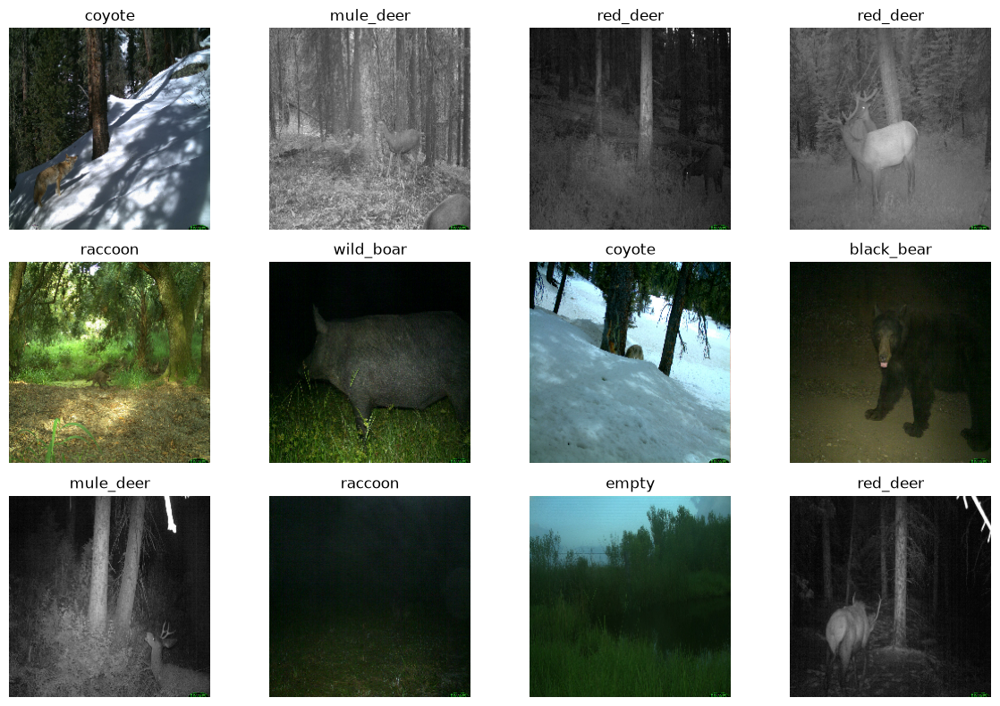
    


## 5. Data augmentation

We use light on-the-fly data augmentation to make the model less sensitive to small visual changes.

Specifically, we use horizontal flips, small zoom changes, and mild contrast variation.


```python
data_augmentation = keras.Sequential(
    [
        layers.RandomFlip("horizontal"),
        layers.RandomZoom(0.10),
        layers.RandomContrast(0.10),
    ],
    name="data_augmentation",
)
```


```python
def show_augmented_examples(dataset, augmentation_layer, n=8):
    """Display original and augmented versions of images from one batch."""
    images, labels = next(iter(dataset))
    images = images[:n]
    labels = labels[:n]

    augmented_images = augmentation_layer(images, training=True)

    plt.figure(figsize=(12, 6))

    for i in range(n):
        ax = plt.subplot(2, n, i + 1)
        plt.imshow(images[i].numpy())
        plt.title(class_names[int(labels[i])])
        plt.axis("off")

        ax = plt.subplot(2, n, n + i + 1)
        plt.imshow(np.clip(augmented_images[i].numpy(), 0, 1))
        plt.axis("off")

    plt.tight_layout()
    plt.show()
```


```python
show_augmented_examples(train_ds, data_augmentation)
```


    
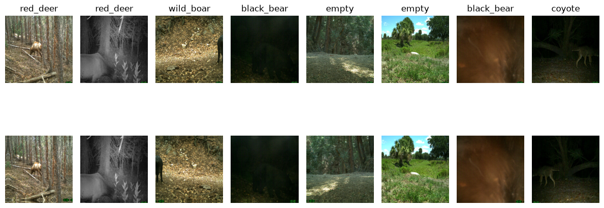
    


```python
def show_augmentation_variability(dataset, augmentation_layer, image_index=0, n=8):
    """Display several augmented versions of one image."""
    images, labels = next(iter(dataset))

    image = images[image_index:image_index + 1]
    label = class_names[int(labels[image_index])]

    plt.figure(figsize=(12, 3))

    for i in range(n):
        augmented_image = augmentation_layer(image, training=True)

        ax = plt.subplot(1, n, i + 1)
        plt.imshow(np.clip(augmented_image[0].numpy(), 0, 1))
        plt.title(label)
        plt.axis("off")

    plt.tight_layout()
    plt.show()
```


```python
show_augmentation_variability(train_ds, data_augmentation, image_index=0)
```


    
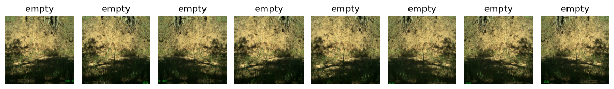
    


## 6. Small CNN baseline

We first train a small CNN from scratch.

This model does not use pretrained weights. Its purpose is to test whether a simple learned feature extractor can outperform the classical baselines.


```python
def build_small_cnn(input_shape=(224, 224, 3), num_classes=8):
    """Build a small CNN classifier."""
    inputs = keras.Input(shape=input_shape)

    x = data_augmentation(inputs)

    x = layers.Conv2D(32, 3, padding="same", activation="relu")(x)
    x = layers.MaxPooling2D()(x)

    x = layers.Conv2D(64, 3, padding="same", activation="relu")(x)
    x = layers.MaxPooling2D()(x)

    x = layers.Conv2D(128, 3, padding="same", activation="relu")(x)
    x = layers.MaxPooling2D()(x)

    x = layers.Conv2D(256, 3, padding="same", activation="relu")(x)
    x = layers.MaxPooling2D()(x)

    x = layers.GlobalAveragePooling2D()(x)
    x = layers.Dropout(0.30)(x)

    outputs = layers.Dense(num_classes, activation="softmax")(x)

    model = keras.Model(inputs, outputs, name="small_cnn")

    return model
```


```python
small_cnn = build_small_cnn(
    input_shape=IMG_SIZE + (3,),
    num_classes=num_classes,
)

small_cnn.summary()
```


<pre style="white-space:pre;overflow-x:auto;line-height:normal;font-family:Menlo,'DejaVu Sans Mono',consolas,'Courier New',monospace"><span style="font-weight: bold">Model: "small_cnn"</span>
</pre>


<pre style="white-space:pre;overflow-x:auto;line-height:normal;font-family:Menlo,'DejaVu Sans Mono',consolas,'Courier New',monospace">┏━━━━━━━━━━━━━━━━━━━━━━━━━━━━━━━━━┳━━━━━━━━━━━━━━━━━━━━━━━━┳━━━━━━━━━━━━━━━┓
┃<span style="font-weight: bold"> Layer (type)                    </span>┃<span style="font-weight: bold"> Output Shape           </span>┃<span style="font-weight: bold">       Param # </span>┃
┡━━━━━━━━━━━━━━━━━━━━━━━━━━━━━━━━━╇━━━━━━━━━━━━━━━━━━━━━━━━╇━━━━━━━━━━━━━━━┩
│ input_layer_1 (<span style="color: #0087ff; text-decoration-color: #0087ff">InputLayer</span>)      │ (<span style="color: #00d7ff; text-decoration-color: #00d7ff">None</span>, <span style="color: #00af00; text-decoration-color: #00af00">224</span>, <span style="color: #00af00; text-decoration-color: #00af00">224</span>, <span style="color: #00af00; text-decoration-color: #00af00">3</span>)    │             <span style="color: #00af00; text-decoration-color: #00af00">0</span> │
├─────────────────────────────────┼────────────────────────┼───────────────┤
│ data_augmentation (<span style="color: #0087ff; text-decoration-color: #0087ff">Sequential</span>)  │ (<span style="color: #00d7ff; text-decoration-color: #00d7ff">None</span>, <span style="color: #00af00; text-decoration-color: #00af00">224</span>, <span style="color: #00af00; text-decoration-color: #00af00">224</span>, <span style="color: #00af00; text-decoration-color: #00af00">3</span>)    │             <span style="color: #00af00; text-decoration-color: #00af00">0</span> │
├─────────────────────────────────┼────────────────────────┼───────────────┤
│ conv2d (<span style="color: #0087ff; text-decoration-color: #0087ff">Conv2D</span>)                 │ (<span style="color: #00d7ff; text-decoration-color: #00d7ff">None</span>, <span style="color: #00af00; text-decoration-color: #00af00">224</span>, <span style="color: #00af00; text-decoration-color: #00af00">224</span>, <span style="color: #00af00; text-decoration-color: #00af00">32</span>)   │           <span style="color: #00af00; text-decoration-color: #00af00">896</span> │
├─────────────────────────────────┼────────────────────────┼───────────────┤
│ max_pooling2d (<span style="color: #0087ff; text-decoration-color: #0087ff">MaxPooling2D</span>)    │ (<span style="color: #00d7ff; text-decoration-color: #00d7ff">None</span>, <span style="color: #00af00; text-decoration-color: #00af00">112</span>, <span style="color: #00af00; text-decoration-color: #00af00">112</span>, <span style="color: #00af00; text-decoration-color: #00af00">32</span>)   │             <span style="color: #00af00; text-decoration-color: #00af00">0</span> │
├─────────────────────────────────┼────────────────────────┼───────────────┤
│ conv2d_1 (<span style="color: #0087ff; text-decoration-color: #0087ff">Conv2D</span>)               │ (<span style="color: #00d7ff; text-decoration-color: #00d7ff">None</span>, <span style="color: #00af00; text-decoration-color: #00af00">112</span>, <span style="color: #00af00; text-decoration-color: #00af00">112</span>, <span style="color: #00af00; text-decoration-color: #00af00">64</span>)   │        <span style="color: #00af00; text-decoration-color: #00af00">18,496</span> │
├─────────────────────────────────┼────────────────────────┼───────────────┤
│ max_pooling2d_1 (<span style="color: #0087ff; text-decoration-color: #0087ff">MaxPooling2D</span>)  │ (<span style="color: #00d7ff; text-decoration-color: #00d7ff">None</span>, <span style="color: #00af00; text-decoration-color: #00af00">56</span>, <span style="color: #00af00; text-decoration-color: #00af00">56</span>, <span style="color: #00af00; text-decoration-color: #00af00">64</span>)     │             <span style="color: #00af00; text-decoration-color: #00af00">0</span> │
├─────────────────────────────────┼────────────────────────┼───────────────┤
│ conv2d_2 (<span style="color: #0087ff; text-decoration-color: #0087ff">Conv2D</span>)               │ (<span style="color: #00d7ff; text-decoration-color: #00d7ff">None</span>, <span style="color: #00af00; text-decoration-color: #00af00">56</span>, <span style="color: #00af00; text-decoration-color: #00af00">56</span>, <span style="color: #00af00; text-decoration-color: #00af00">128</span>)    │        <span style="color: #00af00; text-decoration-color: #00af00">73,856</span> │
├─────────────────────────────────┼────────────────────────┼───────────────┤
│ max_pooling2d_2 (<span style="color: #0087ff; text-decoration-color: #0087ff">MaxPooling2D</span>)  │ (<span style="color: #00d7ff; text-decoration-color: #00d7ff">None</span>, <span style="color: #00af00; text-decoration-color: #00af00">28</span>, <span style="color: #00af00; text-decoration-color: #00af00">28</span>, <span style="color: #00af00; text-decoration-color: #00af00">128</span>)    │             <span style="color: #00af00; text-decoration-color: #00af00">0</span> │
├─────────────────────────────────┼────────────────────────┼───────────────┤
│ conv2d_3 (<span style="color: #0087ff; text-decoration-color: #0087ff">Conv2D</span>)               │ (<span style="color: #00d7ff; text-decoration-color: #00d7ff">None</span>, <span style="color: #00af00; text-decoration-color: #00af00">28</span>, <span style="color: #00af00; text-decoration-color: #00af00">28</span>, <span style="color: #00af00; text-decoration-color: #00af00">256</span>)    │       <span style="color: #00af00; text-decoration-color: #00af00">295,168</span> │
├─────────────────────────────────┼────────────────────────┼───────────────┤
│ max_pooling2d_3 (<span style="color: #0087ff; text-decoration-color: #0087ff">MaxPooling2D</span>)  │ (<span style="color: #00d7ff; text-decoration-color: #00d7ff">None</span>, <span style="color: #00af00; text-decoration-color: #00af00">14</span>, <span style="color: #00af00; text-decoration-color: #00af00">14</span>, <span style="color: #00af00; text-decoration-color: #00af00">256</span>)    │             <span style="color: #00af00; text-decoration-color: #00af00">0</span> │
├─────────────────────────────────┼────────────────────────┼───────────────┤
│ global_average_pooling2d        │ (<span style="color: #00d7ff; text-decoration-color: #00d7ff">None</span>, <span style="color: #00af00; text-decoration-color: #00af00">256</span>)            │             <span style="color: #00af00; text-decoration-color: #00af00">0</span> │
│ (<span style="color: #0087ff; text-decoration-color: #0087ff">GlobalAveragePooling2D</span>)        │                        │               │
├─────────────────────────────────┼────────────────────────┼───────────────┤
│ dropout (<span style="color: #0087ff; text-decoration-color: #0087ff">Dropout</span>)               │ (<span style="color: #00d7ff; text-decoration-color: #00d7ff">None</span>, <span style="color: #00af00; text-decoration-color: #00af00">256</span>)            │             <span style="color: #00af00; text-decoration-color: #00af00">0</span> │
├─────────────────────────────────┼────────────────────────┼───────────────┤
│ dense (<span style="color: #0087ff; text-decoration-color: #0087ff">Dense</span>)                   │ (<span style="color: #00d7ff; text-decoration-color: #00d7ff">None</span>, <span style="color: #00af00; text-decoration-color: #00af00">8</span>)              │         <span style="color: #00af00; text-decoration-color: #00af00">2,056</span> │
└─────────────────────────────────┴────────────────────────┴───────────────┘
</pre>


<pre style="white-space:pre;overflow-x:auto;line-height:normal;font-family:Menlo,'DejaVu Sans Mono',consolas,'Courier New',monospace"><span style="font-weight: bold"> Total params: </span><span style="color: #00af00; text-decoration-color: #00af00">390,472</span> (1.49 MB)
</pre>


<pre style="white-space:pre;overflow-x:auto;line-height:normal;font-family:Menlo,'DejaVu Sans Mono',consolas,'Courier New',monospace"><span style="font-weight: bold"> Trainable params: </span><span style="color: #00af00; text-decoration-color: #00af00">390,472</span> (1.49 MB)
</pre>


<pre style="white-space:pre;overflow-x:auto;line-height:normal;font-family:Menlo,'DejaVu Sans Mono',consolas,'Courier New',monospace"><span style="font-weight: bold"> Non-trainable params: </span><span style="color: #00af00; text-decoration-color: #00af00">0</span> (0.00 B)
</pre>


```python
small_cnn.compile(
    optimizer=keras.optimizers.Adam(learning_rate=1e-3),
    loss="sparse_categorical_crossentropy",
    metrics=["accuracy"],
)
```


```python
callbacks = [
    keras.callbacks.EarlyStopping(
        monitor="val_loss",
        patience=5,
        restore_best_weights=True,
    )
]
```


```python
history_small_cnn = small_cnn.fit(
    train_ds,
    validation_data=val_ds,
    epochs=EPOCHS_SMALL_CNN,
    callbacks=callbacks,
)
```

    Epoch 1/15


    2026-06-15 16:09:19.098238: I tensorflow/core/grappler/optimizers/custom_graph_optimizer_registry.cc:117] Plugin optimizer for device_type GPU is enabled.


    175/175 ━━━━━━━━━━━━━━━━━━━━ 31s 158ms/step - accuracy: 0.2336 - loss: 1.8741 - val_accuracy: 0.2700 - val_loss: 1.7365
    Epoch 2/15
    175/175 ━━━━━━━━━━━━━━━━━━━━ 25s 143ms/step - accuracy: 0.3057 - loss: 1.6706 - val_accuracy: 0.3200 - val_loss: 1.6138
    Epoch 3/15
    175/175 ━━━━━━━━━━━━━━━━━━━━ 24s 138ms/step - accuracy: 0.3395 - loss: 1.6037 - val_accuracy: 0.3583 - val_loss: 1.5578
    Epoch 4/15
    175/175 ━━━━━━━━━━━━━━━━━━━━ 25s 142ms/step - accuracy: 0.3562 - loss: 1.5711 - val_accuracy: 0.3433 - val_loss: 1.5502
    Epoch 5/15
    175/175 ━━━━━━━━━━━━━━━━━━━━ 24s 139ms/step - accuracy: 0.3809 - loss: 1.5276 - val_accuracy: 0.3625 - val_loss: 1.5360
    Epoch 6/15
    175/175 ━━━━━━━━━━━━━━━━━━━━ 25s 144ms/step - accuracy: 0.3925 - loss: 1.5109 - val_accuracy: 0.3650 - val_loss: 1.5375
    Epoch 7/15
    175/175 ━━━━━━━━━━━━━━━━━━━━ 25s 140ms/step - accuracy: 0.4000 - loss: 1.4873 - val_accuracy: 0.4150 - val_loss: 1.4683
    Epoch 8/15
    175/175 ━━━━━━━━━━━━━━━━━━━━ 26s 146ms/step - accuracy: 0.4134 - loss: 1.4681 - val_accuracy: 0.4117 - val_loss: 1.4676
    Epoch 9/15
    175/175 ━━━━━━━━━━━━━━━━━━━━ 30s 168ms/step - accuracy: 0.4166 - loss: 1.4558 - val_accuracy: 0.3958 - val_loss: 1.5213
    Epoch 10/15
    175/175 ━━━━━━━━━━━━━━━━━━━━ 30s 172ms/step - accuracy: 0.4327 - loss: 1.4314 - val_accuracy: 0.4300 - val_loss: 1.4289
    Epoch 11/15
    175/175 ━━━━━━━━━━━━━━━━━━━━ 30s 172ms/step - accuracy: 0.4275 - loss: 1.4250 - val_accuracy: 0.4167 - val_loss: 1.4034
    Epoch 12/15
    175/175 ━━━━━━━━━━━━━━━━━━━━ 31s 174ms/step - accuracy: 0.4279 - loss: 1.4140 - val_accuracy: 0.3958 - val_loss: 1.4551
    Epoch 13/15
    175/175 ━━━━━━━━━━━━━━━━━━━━ 29s 164ms/step - accuracy: 0.4375 - loss: 1.3964 - val_accuracy: 0.3842 - val_loss: 1.5572
    Epoch 14/15
    175/175 ━━━━━━━━━━━━━━━━━━━━ 30s 172ms/step - accuracy: 0.4448 - loss: 1.3971 - val_accuracy: 0.4467 - val_loss: 1.3884
    Epoch 15/15
    175/175 ━━━━━━━━━━━━━━━━━━━━ 30s 170ms/step - accuracy: 0.4409 - loss: 1.3965 - val_accuracy: 0.4067 - val_loss: 1.4574


```python
def plot_history(history):
    """Plot training and validation loss/accuracy."""
    history_df = pd.DataFrame(history.history)

    plt.figure(figsize=(7, 4))
    plt.plot(history_df["loss"], label="train_loss")
    plt.plot(history_df["val_loss"], label="val_loss")
    plt.xlabel("Epoch")
    plt.ylabel("Loss")
    plt.legend()
    plt.show()

    plt.figure(figsize=(7, 4))
    plt.plot(history_df["accuracy"], label="train_accuracy")
    plt.plot(history_df["val_accuracy"], label="val_accuracy")
    plt.xlabel("Epoch")
    plt.ylabel("Accuracy")
    plt.legend()
    plt.show()
```


```python
plot_history(history_small_cnn)
```


    
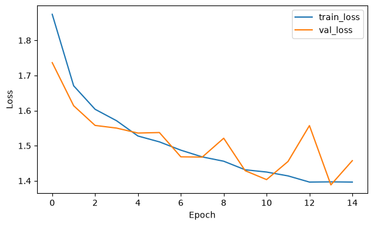
    


    
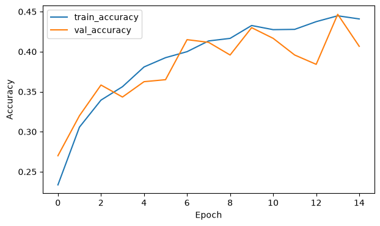
    


After rerunning this notebook on the 1000-per-class dataset, compare the small CNN validation metrics above with the 1000-per-class classical baselines. Training from scratch is expected to be more data-hungry than transfer learning, so this result motivates the MobileNetV2 experiments below.


## 7. Transfer learning with MobileNetV2

The small CNN trained from scratch did not clearly outperform the best classical baseline.

We now use MobileNetV2 as a pretrained feature extractor. The MobileNetV2 backbone is loaded with ImageNet weights and frozen, so only the new classification head is trained for the 8 camera-trap classes.


```python
from tensorflow.keras.applications import MobileNetV2
```


```python
def build_mobilenetv2_model(input_shape=(224, 224, 3), num_classes=8):
    """Build a frozen MobileNetV2 transfer-learning model."""
    inputs = keras.Input(shape=input_shape)

    x = data_augmentation(inputs)
    x = layers.Rescaling(2.0, offset=-1.0, name="mobilenetv2_preprocessing")(x)

    base_model = MobileNetV2(
        input_shape=input_shape,
        include_top=False,
        weights="imagenet",
    )

    base_model.trainable = False

    x = base_model(x, training=False)
    x = layers.GlobalAveragePooling2D()(x)
    x = layers.Dropout(0.30)(x)
    outputs = layers.Dense(num_classes, activation="softmax")(x)

    model = keras.Model(inputs, outputs, name="mobilenetv2_frozen")

    return model
```


```python
mobilenetv2_frozen = build_mobilenetv2_model(
    input_shape=IMG_SIZE + (3,),
    num_classes=num_classes,
)
```


```python
mobilenetv2_frozen.compile(
    optimizer=keras.optimizers.Adam(learning_rate=1e-3),
    loss="sparse_categorical_crossentropy",
    metrics=["accuracy"],
)

mobilenetv2_frozen.summary()
```


<pre style="white-space:pre;overflow-x:auto;line-height:normal;font-family:Menlo,'DejaVu Sans Mono',consolas,'Courier New',monospace"><span style="font-weight: bold">Model: "mobilenetv2_frozen"</span>
</pre>


<pre style="white-space:pre;overflow-x:auto;line-height:normal;font-family:Menlo,'DejaVu Sans Mono',consolas,'Courier New',monospace">┏━━━━━━━━━━━━━━━━━━━━━━━━━━━━━━━━━┳━━━━━━━━━━━━━━━━━━━━━━━━┳━━━━━━━━━━━━━━━┓
┃<span style="font-weight: bold"> Layer (type)                    </span>┃<span style="font-weight: bold"> Output Shape           </span>┃<span style="font-weight: bold">       Param # </span>┃
┡━━━━━━━━━━━━━━━━━━━━━━━━━━━━━━━━━╇━━━━━━━━━━━━━━━━━━━━━━━━╇━━━━━━━━━━━━━━━┩
│ input_layer_2 (<span style="color: #0087ff; text-decoration-color: #0087ff">InputLayer</span>)      │ (<span style="color: #00d7ff; text-decoration-color: #00d7ff">None</span>, <span style="color: #00af00; text-decoration-color: #00af00">224</span>, <span style="color: #00af00; text-decoration-color: #00af00">224</span>, <span style="color: #00af00; text-decoration-color: #00af00">3</span>)    │             <span style="color: #00af00; text-decoration-color: #00af00">0</span> │
├─────────────────────────────────┼────────────────────────┼───────────────┤
│ data_augmentation (<span style="color: #0087ff; text-decoration-color: #0087ff">Sequential</span>)  │ (<span style="color: #00d7ff; text-decoration-color: #00d7ff">None</span>, <span style="color: #00af00; text-decoration-color: #00af00">224</span>, <span style="color: #00af00; text-decoration-color: #00af00">224</span>, <span style="color: #00af00; text-decoration-color: #00af00">3</span>)    │             <span style="color: #00af00; text-decoration-color: #00af00">0</span> │
├─────────────────────────────────┼────────────────────────┼───────────────┤
│ mobilenetv2_preprocessing       │ (<span style="color: #00d7ff; text-decoration-color: #00d7ff">None</span>, <span style="color: #00af00; text-decoration-color: #00af00">224</span>, <span style="color: #00af00; text-decoration-color: #00af00">224</span>, <span style="color: #00af00; text-decoration-color: #00af00">3</span>)    │             <span style="color: #00af00; text-decoration-color: #00af00">0</span> │
│ (<span style="color: #0087ff; text-decoration-color: #0087ff">Rescaling</span>)                     │                        │               │
├─────────────────────────────────┼────────────────────────┼───────────────┤
│ mobilenetv2_1.00_224            │ (<span style="color: #00d7ff; text-decoration-color: #00d7ff">None</span>, <span style="color: #00af00; text-decoration-color: #00af00">7</span>, <span style="color: #00af00; text-decoration-color: #00af00">7</span>, <span style="color: #00af00; text-decoration-color: #00af00">1280</span>)     │     <span style="color: #00af00; text-decoration-color: #00af00">2,257,984</span> │
│ (<span style="color: #0087ff; text-decoration-color: #0087ff">Functional</span>)                    │                        │               │
├─────────────────────────────────┼────────────────────────┼───────────────┤
│ global_average_pooling2d_1      │ (<span style="color: #00d7ff; text-decoration-color: #00d7ff">None</span>, <span style="color: #00af00; text-decoration-color: #00af00">1280</span>)           │             <span style="color: #00af00; text-decoration-color: #00af00">0</span> │
│ (<span style="color: #0087ff; text-decoration-color: #0087ff">GlobalAveragePooling2D</span>)        │                        │               │
├─────────────────────────────────┼────────────────────────┼───────────────┤
│ dropout_1 (<span style="color: #0087ff; text-decoration-color: #0087ff">Dropout</span>)             │ (<span style="color: #00d7ff; text-decoration-color: #00d7ff">None</span>, <span style="color: #00af00; text-decoration-color: #00af00">1280</span>)           │             <span style="color: #00af00; text-decoration-color: #00af00">0</span> │
├─────────────────────────────────┼────────────────────────┼───────────────┤
│ dense_1 (<span style="color: #0087ff; text-decoration-color: #0087ff">Dense</span>)                 │ (<span style="color: #00d7ff; text-decoration-color: #00d7ff">None</span>, <span style="color: #00af00; text-decoration-color: #00af00">8</span>)              │        <span style="color: #00af00; text-decoration-color: #00af00">10,248</span> │
└─────────────────────────────────┴────────────────────────┴───────────────┘
</pre>


<pre style="white-space:pre;overflow-x:auto;line-height:normal;font-family:Menlo,'DejaVu Sans Mono',consolas,'Courier New',monospace"><span style="font-weight: bold"> Total params: </span><span style="color: #00af00; text-decoration-color: #00af00">2,268,232</span> (8.65 MB)
</pre>


<pre style="white-space:pre;overflow-x:auto;line-height:normal;font-family:Menlo,'DejaVu Sans Mono',consolas,'Courier New',monospace"><span style="font-weight: bold"> Trainable params: </span><span style="color: #00af00; text-decoration-color: #00af00">10,248</span> (40.03 KB)
</pre>


<pre style="white-space:pre;overflow-x:auto;line-height:normal;font-family:Menlo,'DejaVu Sans Mono',consolas,'Courier New',monospace"><span style="font-weight: bold"> Non-trainable params: </span><span style="color: #00af00; text-decoration-color: #00af00">2,257,984</span> (8.61 MB)
</pre>


```python
callbacks_mobilenet = [
    keras.callbacks.EarlyStopping(
        monitor="val_loss",
        patience=5,
        restore_best_weights=True,
    )
]
```


```python
history_mobilenetv2_frozen = mobilenetv2_frozen.fit(
    train_ds,
    validation_data=val_ds,
    epochs=EPOCHS_TRANSFER,
    callbacks=callbacks_mobilenet,
)
```

    Epoch 1/10
    175/175 ━━━━━━━━━━━━━━━━━━━━ 40s 211ms/step - accuracy: 0.5238 - loss: 1.3443 - val_accuracy: 0.6342 - val_loss: 0.9759
    Epoch 2/10
    175/175 ━━━━━━━━━━━━━━━━━━━━ 36s 203ms/step - accuracy: 0.6288 - loss: 1.0082 - val_accuracy: 0.6750 - val_loss: 0.8671
    Epoch 3/10
    175/175 ━━━━━━━━━━━━━━━━━━━━ 32s 185ms/step - accuracy: 0.6559 - loss: 0.9261 - val_accuracy: 0.6925 - val_loss: 0.8461
    Epoch 4/10
    175/175 ━━━━━━━━━━━━━━━━━━━━ 31s 175ms/step - accuracy: 0.6725 - loss: 0.8849 - val_accuracy: 0.6975 - val_loss: 0.8240
    Epoch 5/10
    175/175 ━━━━━━━━━━━━━━━━━━━━ 32s 182ms/step - accuracy: 0.6889 - loss: 0.8557 - val_accuracy: 0.6917 - val_loss: 0.8125
    Epoch 6/10
    175/175 ━━━━━━━━━━━━━━━━━━━━ 31s 178ms/step - accuracy: 0.6943 - loss: 0.8220 - val_accuracy: 0.6858 - val_loss: 0.8304
    Epoch 7/10
    175/175 ━━━━━━━━━━━━━━━━━━━━ 29s 163ms/step - accuracy: 0.7000 - loss: 0.8040 - val_accuracy: 0.6842 - val_loss: 0.8360
    Epoch 8/10
    175/175 ━━━━━━━━━━━━━━━━━━━━ 31s 177ms/step - accuracy: 0.7048 - loss: 0.7971 - val_accuracy: 0.6925 - val_loss: 0.8214
    Epoch 9/10
    175/175 ━━━━━━━━━━━━━━━━━━━━ 34s 197ms/step - accuracy: 0.7046 - loss: 0.7963 - val_accuracy: 0.7017 - val_loss: 0.7970
    Epoch 10/10
    175/175 ━━━━━━━━━━━━━━━━━━━━ 35s 199ms/step - accuracy: 0.7063 - loss: 0.7756 - val_accuracy: 0.7000 - val_loss: 0.7913


```python
plot_history(history_mobilenetv2_frozen)
```


    
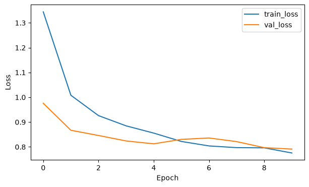
    


    
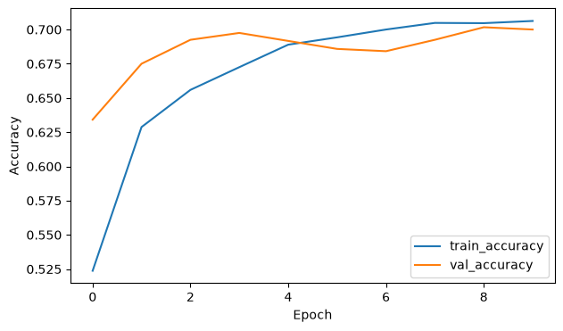
    


```python
def get_predictions(model, dataset):
    """Return true labels, predicted labels, and predicted probabilities."""
    y_true = []
    y_prob = []

    for images, labels in dataset:
        probs = model.predict(images, verbose=0)

        y_true.extend(labels.numpy())
        y_prob.extend(probs)

    y_true = np.array(y_true)
    y_prob = np.array(y_prob)
    y_pred = np.argmax(y_prob, axis=1)

    return y_true, y_pred, y_prob
```


```python
y_val_true, y_val_pred, y_val_prob = get_predictions(
    mobilenetv2_frozen,
    val_ds,
)
```

    2026-06-15 16:21:55.731055: I tensorflow/core/framework/local_rendezvous.cc:405] Local rendezvous is aborting with status: OUT_OF_RANGE: End of sequence


```python
val_accuracy = accuracy_score(y_val_true, y_val_pred)
val_macro_f1 = f1_score(y_val_true, y_val_pred, average="macro")

print(f"Validation accuracy: {val_accuracy:.4f}")
print(f"Validation macro-F1:  {val_macro_f1:.4f}")
```

    Validation accuracy: 0.7000
    Validation macro-F1:  0.7014


```python
print(
    classification_report(
        y_val_true,
        y_val_pred,
        target_names=class_names,
    )
)
```

                  precision    recall  f1-score   support
    
      black_bear       0.91      0.75      0.82       150
          bobcat       0.77      0.72      0.74       150
          coyote       0.69      0.73      0.71       150
           empty       0.66      0.73      0.69       150
       mule_deer       0.74      0.67      0.70       150
         raccoon       0.63      0.55      0.59       150
        red_deer       0.68      0.72      0.70       150
       wild_boar       0.59      0.74      0.65       150
    
        accuracy                           0.70      1200
       macro avg       0.71      0.70      0.70      1200
    weighted avg       0.71      0.70      0.70      1200
    


```python
cm = confusion_matrix(y_val_true, y_val_pred)

disp = ConfusionMatrixDisplay(
    confusion_matrix=cm,
    display_labels=class_names,
)

fig, ax = plt.subplots(figsize=(9, 9))
disp.plot(ax=ax, xticks_rotation=45, colorbar=False)
plt.title("Frozen MobileNetV2 - Validation Confusion Matrix")
plt.show()
```


    
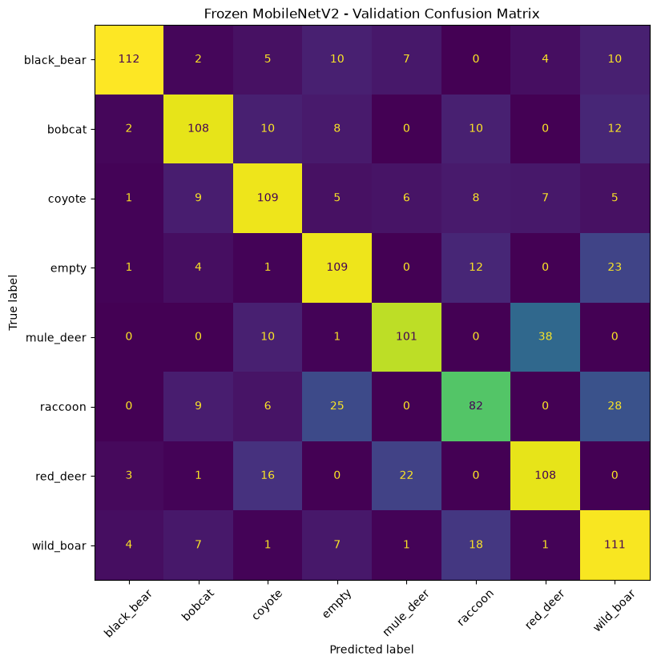
    


Use the validation metrics and confusion matrix above to compare the frozen MobileNetV2 model with the classical baselines and the small CNN on the 1000-per-class dataset.

The confusion matrix and misclassified examples are useful for understanding whether the remaining errors are driven by small animals, night images, occlusion, confusing backgrounds, empty/animal ambiguity, or visually similar species.


```python
MODELS_DIR = PROJECT_ROOT / "models"
MODELS_DIR.mkdir(parents=True, exist_ok=True)

small_cnn.save(MODELS_DIR / "small_cnn_1000_per_class.keras")
mobilenetv2_frozen.save(MODELS_DIR / "mobilenetv2_frozen_1000_per_class.keras")

for model_path in (
    MODELS_DIR / "small_cnn_1000_per_class.keras",
    MODELS_DIR / "mobilenetv2_frozen_1000_per_class.keras",
):
    keras.models.load_model(model_path)

```


```python
pd.DataFrame(history_small_cnn.history).to_csv(
    MODELS_DIR / "small_cnn_1000_per_class_history.csv",
    index=False,
)

pd.DataFrame(history_mobilenetv2_frozen.history).to_csv(
    MODELS_DIR / "mobilenetv2_frozen_1000_per_class_history.csv",
    index=False,
)

```

## 8. Visual error analysis

We inspect validation examples that were misclassified by the frozen MobileNetV2 model.

This helps identify whether the remaining errors are caused by small animals, night images, occlusion, confusing backgrounds, empty/animal ambiguity, or visually similar species.


```python
def get_validation_results_df(df, y_true, y_pred, y_prob):
    """Create a dataframe with predictions and confidence scores."""
    results_df = df.copy().reset_index(drop=True)

    results_df["true_idx"] = y_true
    results_df["pred_idx"] = y_pred
    results_df["true_label"] = results_df["true_idx"].map(idx_to_label)
    results_df["pred_label"] = results_df["pred_idx"].map(idx_to_label)
    results_df["confidence"] = np.max(y_prob, axis=1)
    results_df["correct"] = results_df["true_idx"] == results_df["pred_idx"]

    return results_df
```


```python
val_results_df = get_validation_results_df(
    val_df,
    y_val_true,
    y_val_pred,
    y_val_prob,
)

val_results_df.head()
```


<div>
<style scoped>
    .dataframe tbody tr th:only-of-type {
        vertical-align: middle;
    }

    .dataframe tbody tr th {
        vertical-align: top;
    }

    .dataframe thead th {
        text-align: right;
    }
</style>
<table border="1" class="dataframe">
  <thead>
    <tr style="text-align: right;">
      <th></th>
      <th>image_id</th>
      <th>file_name</th>
      <th>label</th>
      <th>category_id</th>
      <th>image_url</th>
      <th>local_path</th>
      <th>readable_label</th>
      <th>exists</th>
      <th>can_open</th>
      <th>width</th>
      <th>...</th>
      <th>local_path_rel</th>
      <th>cropped_path_rel</th>
      <th>label_idx</th>
      <th>image_path</th>
      <th>true_idx</th>
      <th>pred_idx</th>
      <th>true_label</th>
      <th>pred_label</th>
      <th>confidence</th>
      <th>correct</th>
    </tr>
  </thead>
  <tbody>
    <tr>
      <th>0</th>
      <td>2010_Unit170_Ivan045_img0945.jpg</td>
      <td>part0/sub005/2010_Unit170_Ivan045_img0945.jpg</td>
      <td>odocoileus hemionus</td>
      <td>46</td>
      <td>https://storage.googleapis.com/public-datasets...</td>
      <td>/Users/mihnea/Desktop/Proiecte personale/wildl...</td>
      <td>mule_deer</td>
      <td>True</td>
      <td>True</td>
      <td>2048</td>
      <td>...</td>
      <td>data/raw/images/part0/sub005/2010_Unit170_Ivan...</td>
      <td>data/processed/cropped_images/part0/sub005/201...</td>
      <td>4</td>
      <td>/Users/mihnea/Desktop/Proiecte personale/wildl...</td>
      <td>4</td>
      <td>4</td>
      <td>mule_deer</td>
      <td>mule_deer</td>
      <td>0.788876</td>
      <td>True</td>
    </tr>
    <tr>
      <th>1</th>
      <td>FL-38_11_03_2015_FL-38_0003815.jpg</td>
      <td>part2/sub282/FL-38_11_03_2015_FL-38_0003815.jpg</td>
      <td>lynx rufus</td>
      <td>26</td>
      <td>https://storage.googleapis.com/public-datasets...</td>
      <td>/Users/mihnea/Desktop/Proiecte personale/wildl...</td>
      <td>bobcat</td>
      <td>True</td>
      <td>True</td>
      <td>2048</td>
      <td>...</td>
      <td>data/raw/images/part2/sub282/FL-38_11_03_2015_...</td>
      <td>data/processed/cropped_images/part2/sub282/FL-...</td>
      <td>1</td>
      <td>/Users/mihnea/Desktop/Proiecte personale/wildl...</td>
      <td>1</td>
      <td>1</td>
      <td>bobcat</td>
      <td>bobcat</td>
      <td>0.993135</td>
      <td>True</td>
    </tr>
    <tr>
      <th>2</th>
      <td>2015_Unit009_Ivan052_img0113.jpg</td>
      <td>part0/sub018/2015_Unit009_Ivan052_img0113.jpg</td>
      <td>canis latrans</td>
      <td>6</td>
      <td>https://storage.googleapis.com/public-datasets...</td>
      <td>/Users/mihnea/Desktop/Proiecte personale/wildl...</td>
      <td>coyote</td>
      <td>True</td>
      <td>True</td>
      <td>2048</td>
      <td>...</td>
      <td>data/raw/images/part0/sub018/2015_Unit009_Ivan...</td>
      <td>data/processed/cropped_images/part0/sub018/201...</td>
      <td>2</td>
      <td>/Users/mihnea/Desktop/Proiecte personale/wildl...</td>
      <td>2</td>
      <td>2</td>
      <td>coyote</td>
      <td>coyote</td>
      <td>0.936235</td>
      <td>True</td>
    </tr>
    <tr>
      <th>3</th>
      <td>FL-01_09_02_2015_FL-01_0037608.jpg</td>
      <td>part1/sub116/FL-01_09_02_2015_FL-01_0037608.jpg</td>
      <td>lynx rufus</td>
      <td>26</td>
      <td>https://storage.googleapis.com/public-datasets...</td>
      <td>/Users/mihnea/Desktop/Proiecte personale/wildl...</td>
      <td>bobcat</td>
      <td>True</td>
      <td>True</td>
      <td>2048</td>
      <td>...</td>
      <td>data/raw/images/part1/sub116/FL-01_09_02_2015_...</td>
      <td>data/processed/cropped_images/part1/sub116/FL-...</td>
      <td>1</td>
      <td>/Users/mihnea/Desktop/Proiecte personale/wildl...</td>
      <td>1</td>
      <td>1</td>
      <td>bobcat</td>
      <td>bobcat</td>
      <td>0.971558</td>
      <td>True</td>
    </tr>
    <tr>
      <th>4</th>
      <td>CA-38_10_07_2015_CA-38_0023157.jpg</td>
      <td>part0/sub095/CA-38_10_07_2015_CA-38_0023157.jpg</td>
      <td>ursus americanus</td>
      <td>67</td>
      <td>https://storage.googleapis.com/public-datasets...</td>
      <td>/Users/mihnea/Desktop/Proiecte personale/wildl...</td>
      <td>black_bear</td>
      <td>True</td>
      <td>True</td>
      <td>2048</td>
      <td>...</td>
      <td>data/raw/images/part0/sub095/CA-38_10_07_2015_...</td>
      <td>data/processed/cropped_images/part0/sub095/CA-...</td>
      <td>0</td>
      <td>/Users/mihnea/Desktop/Proiecte personale/wildl...</td>
      <td>0</td>
      <td>7</td>
      <td>black_bear</td>
      <td>wild_boar</td>
      <td>0.302577</td>
      <td>False</td>
    </tr>
  </tbody>
</table>
<p>5 rows × 25 columns</p>
</div>


```python
val_results_df["correct"].value_counts()
```


    correct
    True     840
    False    360
    Name: count, dtype: int64


```python
def show_prediction_examples(results_df, correct=False, n=12, sort_by_confidence=True, ncols=4):
    """Display correct or incorrect predictions with readable spacing."""
    examples = results_df[results_df["correct"] == correct].copy()

    if sort_by_confidence:
        examples = examples.sort_values("confidence", ascending=False)

    examples = examples.head(n)

    nrows = int(np.ceil(len(examples) / ncols))

    fig, axes = plt.subplots(
        nrows=nrows,
        ncols=ncols,
        figsize=(4 * ncols, 4.8 * nrows),
    )

    axes = np.array(axes).reshape(-1)

    for ax, (_, row) in zip(axes, examples.iterrows()):
        image = plt.imread(row["image_path"])

        ax.imshow(image)
        ax.set_title(
            f"True: {row['true_label']}\n"
            f"Pred: {row['pred_label']}\n"
            f"Conf: {row['confidence']:.2f}",
            fontsize=10,
            pad=8,
        )
        ax.axis("off")

    for ax in axes[len(examples):]:
        ax.axis("off")

    plt.tight_layout(h_pad=3.0, w_pad=1.5)
    plt.show()

```


```python
show_prediction_examples(
    val_results_df,
    correct=False,
    n=12,
    sort_by_confidence=True,
    ncols=4,
)
```


    
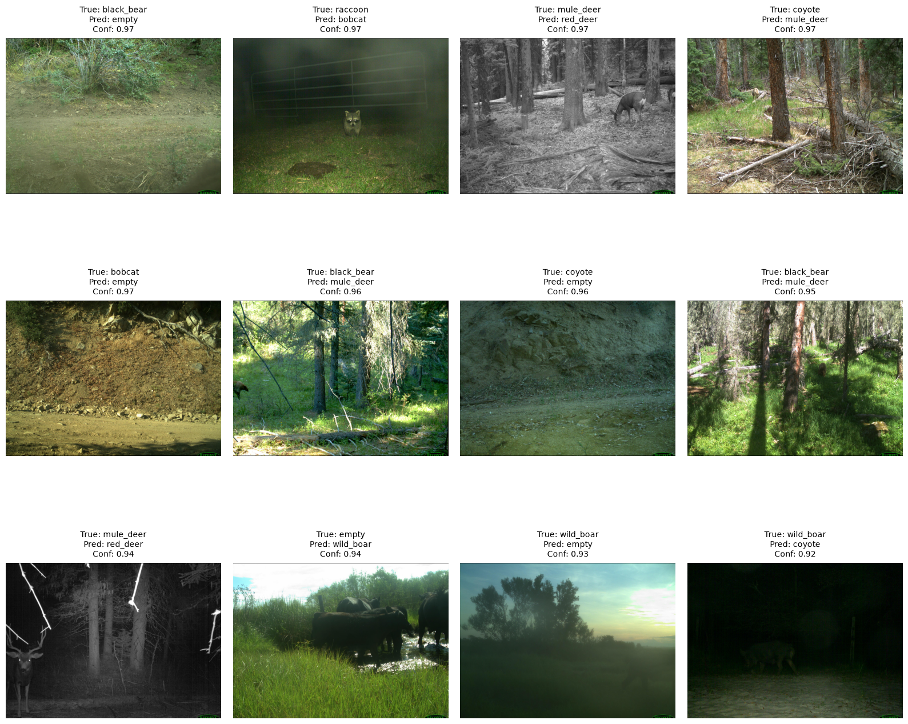
    


The most confident MobileNetV2 errors are often visually difficult cases. Several animals are small, partially occluded, poorly illuminated, or blended into the background. Some mistakes are also semantically plausible, such as red deer being confused with mule deer, or small nocturnal mammals being confused with each other.

The model sometimes predicts `empty` for images where the animal is very subtle, suggesting that animal detection remains a challenge. However, many errors are species-to-species confusions, so the problem is not only empty/non-empty separation.

These examples suggest that the remaining difficulty comes from a combination of small object size, occlusion, low illumination, background clutter, and visually similar species.

## 9. Fine-tuning MobileNetV2

As the final deep-learning experiment, we fine-tune the last layers of MobileNetV2. Most of the pretrained backbone remains frozen, while the upper layers are allowed to adapt to the 1000-per-class camera-trap dataset.


```python
base_model = mobilenetv2_frozen.get_layer("mobilenetv2_1.00_224")
base_model.trainable = True
```


```python
fine_tune_at = 120

for layer in base_model.layers[:fine_tune_at]:
    layer.trainable = False

for layer in base_model.layers[fine_tune_at:]:
    layer.trainable = True
```


```python
mobilenetv2_frozen.compile(
    optimizer=keras.optimizers.Adam(learning_rate=1e-5),
    loss="sparse_categorical_crossentropy",
    metrics=["accuracy"],
)

mobilenetv2_frozen.summary()
```


<pre style="white-space:pre;overflow-x:auto;line-height:normal;font-family:Menlo,'DejaVu Sans Mono',consolas,'Courier New',monospace"><span style="font-weight: bold">Model: "mobilenetv2_frozen"</span>
</pre>


<pre style="white-space:pre;overflow-x:auto;line-height:normal;font-family:Menlo,'DejaVu Sans Mono',consolas,'Courier New',monospace">┏━━━━━━━━━━━━━━━━━━━━━━━━━━━━━━━━━┳━━━━━━━━━━━━━━━━━━━━━━━━┳━━━━━━━━━━━━━━━┓
┃<span style="font-weight: bold"> Layer (type)                    </span>┃<span style="font-weight: bold"> Output Shape           </span>┃<span style="font-weight: bold">       Param # </span>┃
┡━━━━━━━━━━━━━━━━━━━━━━━━━━━━━━━━━╇━━━━━━━━━━━━━━━━━━━━━━━━╇━━━━━━━━━━━━━━━┩
│ input_layer_2 (<span style="color: #0087ff; text-decoration-color: #0087ff">InputLayer</span>)      │ (<span style="color: #00d7ff; text-decoration-color: #00d7ff">None</span>, <span style="color: #00af00; text-decoration-color: #00af00">224</span>, <span style="color: #00af00; text-decoration-color: #00af00">224</span>, <span style="color: #00af00; text-decoration-color: #00af00">3</span>)    │             <span style="color: #00af00; text-decoration-color: #00af00">0</span> │
├─────────────────────────────────┼────────────────────────┼───────────────┤
│ data_augmentation (<span style="color: #0087ff; text-decoration-color: #0087ff">Sequential</span>)  │ (<span style="color: #00d7ff; text-decoration-color: #00d7ff">None</span>, <span style="color: #00af00; text-decoration-color: #00af00">224</span>, <span style="color: #00af00; text-decoration-color: #00af00">224</span>, <span style="color: #00af00; text-decoration-color: #00af00">3</span>)    │             <span style="color: #00af00; text-decoration-color: #00af00">0</span> │
├─────────────────────────────────┼────────────────────────┼───────────────┤
│ mobilenetv2_preprocessing       │ (<span style="color: #00d7ff; text-decoration-color: #00d7ff">None</span>, <span style="color: #00af00; text-decoration-color: #00af00">224</span>, <span style="color: #00af00; text-decoration-color: #00af00">224</span>, <span style="color: #00af00; text-decoration-color: #00af00">3</span>)    │             <span style="color: #00af00; text-decoration-color: #00af00">0</span> │
│ (<span style="color: #0087ff; text-decoration-color: #0087ff">Rescaling</span>)                     │                        │               │
├─────────────────────────────────┼────────────────────────┼───────────────┤
│ mobilenetv2_1.00_224            │ (<span style="color: #00d7ff; text-decoration-color: #00d7ff">None</span>, <span style="color: #00af00; text-decoration-color: #00af00">7</span>, <span style="color: #00af00; text-decoration-color: #00af00">7</span>, <span style="color: #00af00; text-decoration-color: #00af00">1280</span>)     │     <span style="color: #00af00; text-decoration-color: #00af00">2,257,984</span> │
│ (<span style="color: #0087ff; text-decoration-color: #0087ff">Functional</span>)                    │                        │               │
├─────────────────────────────────┼────────────────────────┼───────────────┤
│ global_average_pooling2d_1      │ (<span style="color: #00d7ff; text-decoration-color: #00d7ff">None</span>, <span style="color: #00af00; text-decoration-color: #00af00">1280</span>)           │             <span style="color: #00af00; text-decoration-color: #00af00">0</span> │
│ (<span style="color: #0087ff; text-decoration-color: #0087ff">GlobalAveragePooling2D</span>)        │                        │               │
├─────────────────────────────────┼────────────────────────┼───────────────┤
│ dropout_1 (<span style="color: #0087ff; text-decoration-color: #0087ff">Dropout</span>)             │ (<span style="color: #00d7ff; text-decoration-color: #00d7ff">None</span>, <span style="color: #00af00; text-decoration-color: #00af00">1280</span>)           │             <span style="color: #00af00; text-decoration-color: #00af00">0</span> │
├─────────────────────────────────┼────────────────────────┼───────────────┤
│ dense_1 (<span style="color: #0087ff; text-decoration-color: #0087ff">Dense</span>)                 │ (<span style="color: #00d7ff; text-decoration-color: #00d7ff">None</span>, <span style="color: #00af00; text-decoration-color: #00af00">8</span>)              │        <span style="color: #00af00; text-decoration-color: #00af00">10,248</span> │
└─────────────────────────────────┴────────────────────────┴───────────────┘
</pre>


<pre style="white-space:pre;overflow-x:auto;line-height:normal;font-family:Menlo,'DejaVu Sans Mono',consolas,'Courier New',monospace"><span style="font-weight: bold"> Total params: </span><span style="color: #00af00; text-decoration-color: #00af00">2,268,232</span> (8.65 MB)
</pre>


<pre style="white-space:pre;overflow-x:auto;line-height:normal;font-family:Menlo,'DejaVu Sans Mono',consolas,'Courier New',monospace"><span style="font-weight: bold"> Trainable params: </span><span style="color: #00af00; text-decoration-color: #00af00">1,635,144</span> (6.24 MB)
</pre>


<pre style="white-space:pre;overflow-x:auto;line-height:normal;font-family:Menlo,'DejaVu Sans Mono',consolas,'Courier New',monospace"><span style="font-weight: bold"> Non-trainable params: </span><span style="color: #00af00; text-decoration-color: #00af00">633,088</span> (2.42 MB)
</pre>


```python
callbacks_finetune = [
    keras.callbacks.EarlyStopping(
        monitor="val_loss",
        patience=5,
        restore_best_weights=True,
    )
]
```


```python
history_mobilenetv2_finetuned = mobilenetv2_frozen.fit(
    train_ds,
    validation_data=val_ds,
    epochs=10,
    callbacks=callbacks_finetune,
)
```

    Epoch 1/10
    175/175 ━━━━━━━━━━━━━━━━━━━━ 52s 256ms/step - accuracy: 0.5946 - loss: 1.1333 - val_accuracy: 0.6842 - val_loss: 0.8642
    Epoch 2/10
    175/175 ━━━━━━━━━━━━━━━━━━━━ 44s 248ms/step - accuracy: 0.6523 - loss: 0.9721 - val_accuracy: 0.6975 - val_loss: 0.8471
    Epoch 3/10
    175/175 ━━━━━━━━━━━━━━━━━━━━ 39s 222ms/step - accuracy: 0.6729 - loss: 0.8775 - val_accuracy: 0.7017 - val_loss: 0.8375
    Epoch 4/10
    175/175 ━━━━━━━━━━━━━━━━━━━━ 43s 248ms/step - accuracy: 0.6895 - loss: 0.8466 - val_accuracy: 0.7058 - val_loss: 0.8160
    Epoch 5/10
    175/175 ━━━━━━━━━━━━━━━━━━━━ 44s 252ms/step - accuracy: 0.7023 - loss: 0.7894 - val_accuracy: 0.7125 - val_loss: 0.7977
    Epoch 6/10
    175/175 ━━━━━━━━━━━━━━━━━━━━ 41s 235ms/step - accuracy: 0.7279 - loss: 0.7407 - val_accuracy: 0.7208 - val_loss: 0.7811
    Epoch 7/10
    175/175 ━━━━━━━━━━━━━━━━━━━━ 39s 222ms/step - accuracy: 0.7339 - loss: 0.7190 - val_accuracy: 0.7200 - val_loss: 0.7744
    Epoch 8/10
    175/175 ━━━━━━━━━━━━━━━━━━━━ 36s 207ms/step - accuracy: 0.7386 - loss: 0.7042 - val_accuracy: 0.7217 - val_loss: 0.7627
    Epoch 9/10
    175/175 ━━━━━━━━━━━━━━━━━━━━ 37s 213ms/step - accuracy: 0.7521 - loss: 0.6630 - val_accuracy: 0.7242 - val_loss: 0.7585
    Epoch 10/10
    175/175 ━━━━━━━━━━━━━━━━━━━━ 39s 221ms/step - accuracy: 0.7663 - loss: 0.6362 - val_accuracy: 0.7317 - val_loss: 0.7460


```python
plot_history(history_mobilenetv2_finetuned)
```


    
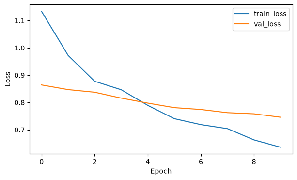
    


    
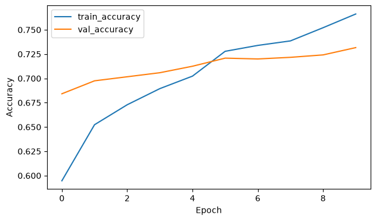
    


```python
mobilenetv2_finetuned = mobilenetv2_frozen

y_val_true_ft, y_val_pred_ft, y_val_prob_ft = get_predictions(
    mobilenetv2_finetuned,
    val_ds,
)

val_accuracy_ft = accuracy_score(y_val_true_ft, y_val_pred_ft)
val_macro_f1_ft = f1_score(y_val_true_ft, y_val_pred_ft, average="macro")

print(f"Validation accuracy: {val_accuracy_ft:.4f}")
print(f"Validation macro-F1:  {val_macro_f1_ft:.4f}")
```

    Validation accuracy: 0.7317
    Validation macro-F1:  0.7341


```python
print(
    classification_report(
        y_val_true_ft,
        y_val_pred_ft,
        target_names=class_names,
    )
)
```

                  precision    recall  f1-score   support
    
      black_bear       0.91      0.77      0.83       150
          bobcat       0.83      0.72      0.77       150
          coyote       0.81      0.67      0.74       150
           empty       0.65      0.79      0.71       150
       mule_deer       0.69      0.81      0.74       150
         raccoon       0.58      0.77      0.66       150
        red_deer       0.80      0.68      0.73       150
       wild_boar       0.73      0.63      0.68       150
    
        accuracy                           0.73      1200
       macro avg       0.75      0.73      0.73      1200
    weighted avg       0.75      0.73      0.73      1200
    


Use the validation metrics above to compare the fine-tuned MobileNetV2 model with the frozen MobileNetV2 model on the 1000-per-class dataset.

The size of the improvement indicates how much additional benefit comes from adapting the upper pretrained layers beyond using MobileNetV2 as a fixed feature extractor.


```python
results = pd.DataFrame([
    {
        "model": "Majority baseline",
        "val_accuracy": None,
        "val_macro_f1": None,
        "notes": "Fill from 1000-per-class classical baseline rerun",
    },
    {
        "model": "Pixels + Logistic Regression",
        "val_accuracy": None,
        "val_macro_f1": None,
        "notes": "Fill from 1000-per-class classical baseline rerun",
    },
    {
        "model": "HOG + Linear SVM",
        "val_accuracy": None,
        "val_macro_f1": None,
        "notes": "Fill from 1000-per-class classical baseline rerun",
    },
    {
        "model": "HOG + color histograms + Linear SVM",
        "val_accuracy": None,
        "val_macro_f1": None,
        "notes": "Fill from 1000-per-class classical baseline rerun",
    },
    {
        "model": "Small CNN from scratch",
        "val_accuracy": max(history_small_cnn.history["val_accuracy"]),
        "val_macro_f1": None,
        "notes": "Learned from scratch",
    },
    {
        "model": "Frozen MobileNetV2",
        "val_accuracy": val_accuracy,
        "val_macro_f1": val_macro_f1,
        "notes": "Pretrained feature extractor",
    },
    {
        "model": "Fine-tuned MobileNetV2",
        "val_accuracy": val_accuracy_ft,
        "val_macro_f1": val_macro_f1_ft,
        "notes": "Best validation model",
    },
])

results

```


<div>
<style scoped>
    .dataframe tbody tr th:only-of-type {
        vertical-align: middle;
    }

    .dataframe tbody tr th {
        vertical-align: top;
    }

    .dataframe thead th {
        text-align: right;
    }
</style>
<table border="1" class="dataframe">
  <thead>
    <tr style="text-align: right;">
      <th></th>
      <th>model</th>
      <th>val_accuracy</th>
      <th>val_macro_f1</th>
      <th>notes</th>
    </tr>
  </thead>
  <tbody>
    <tr>
      <th>0</th>
      <td>Majority baseline</td>
      <td>NaN</td>
      <td>NaN</td>
      <td>Fill from 1000-per-class classical baseline rerun</td>
    </tr>
    <tr>
      <th>1</th>
      <td>Pixels + Logistic Regression</td>
      <td>NaN</td>
      <td>NaN</td>
      <td>Fill from 1000-per-class classical baseline rerun</td>
    </tr>
    <tr>
      <th>2</th>
      <td>HOG + Linear SVM</td>
      <td>NaN</td>
      <td>NaN</td>
      <td>Fill from 1000-per-class classical baseline rerun</td>
    </tr>
    <tr>
      <th>3</th>
      <td>HOG + color histograms + Linear SVM</td>
      <td>NaN</td>
      <td>NaN</td>
      <td>Fill from 1000-per-class classical baseline rerun</td>
    </tr>
    <tr>
      <th>4</th>
      <td>Small CNN from scratch</td>
      <td>0.446667</td>
      <td>NaN</td>
      <td>Learned from scratch</td>
    </tr>
    <tr>
      <th>5</th>
      <td>Frozen MobileNetV2</td>
      <td>0.700000</td>
      <td>0.701364</td>
      <td>Pretrained feature extractor</td>
    </tr>
    <tr>
      <th>6</th>
      <td>Fine-tuned MobileNetV2</td>
      <td>0.731667</td>
      <td>0.734082</td>
      <td>Best validation model</td>
    </tr>
  </tbody>
</table>
</div>


```python
REPORTS_DIR = PROJECT_ROOT / "reports"
REPORTS_DIR.mkdir(parents=True, exist_ok=True)

results.to_csv(REPORTS_DIR / "deep_learning_results_1000_per_class.csv", index=False)

```


```python
mobilenetv2_finetuned = mobilenetv2_frozen

```


```python
mobilenetv2_finetuned.save(MODELS_DIR / "mobilenetv2_finetuned_1000_per_class.keras")
keras.models.load_model(MODELS_DIR / "mobilenetv2_finetuned_1000_per_class.keras")

pd.DataFrame(history_mobilenetv2_finetuned.history).to_csv(
    MODELS_DIR / "mobilenetv2_finetuned_1000_per_class_history.csv",
    index=False,
)

```

## Conclusions

After rerunning the notebook, use the metrics above to compare the same deep learning experiments on the 1000-per-class dataset.

The expected interpretation remains the same: compare a small CNN trained from scratch against frozen MobileNetV2 and then fine-tuned MobileNetV2, using validation accuracy, validation macro-F1, confusion matrices, and visual inspection of high-confidence errors.


