# 04 - Error Analysis and Explainability

Validation-set error analysis for the 1000-per-class MobileNetV2 workflow.


## 1. Notebook goal

Find the errors that point to the next accuracy improvements.


## 2. Imports and configuration


```python
from pathlib import Path
import sys
import random

import numpy as np
import pandas as pd
import matplotlib.pyplot as plt
from PIL import Image

import tensorflow as tf
from tensorflow import keras

from sklearn.metrics import (
    accuracy_score,
    f1_score,
    classification_report,
    confusion_matrix,
    ConfusionMatrixDisplay,
)

SEED = 42

random.seed(SEED)
np.random.seed(SEED)
tf.random.set_seed(SEED)

PROJECT_ROOT = Path.cwd()
if not (PROJECT_ROOT / "data").exists():
    PROJECT_ROOT = PROJECT_ROOT.parent

if str(PROJECT_ROOT.resolve()) not in sys.path:
    sys.path.append(str(PROJECT_ROOT.resolve()))

from src.download_data import READABLE_LABELS

DATA_DIR = PROJECT_ROOT / "data"
METADATA_DIR = DATA_DIR / "metadata"
MODELS_DIR = PROJECT_ROOT / "models"
REPORTS_DIR = PROJECT_ROOT / "reports"
FIGURES_DIR = REPORTS_DIR / "figures"

TRAIN_CSV = METADATA_DIR / "train_1000.csv"
VAL_CSV = METADATA_DIR / "val_1000.csv"
TEST_CSV = METADATA_DIR / "test_1000.csv"

MODEL_PATHS = {
    "finetuned": MODELS_DIR / "mobilenetv2_finetuned_1000_per_class.keras",
    "frozen": MODELS_DIR / "mobilenetv2_frozen_1000_per_class.keras",
}
PRIMARY_MODEL_NAME = "finetuned"

IMG_SIZE = (224, 224)
BATCH_SIZE = 64

REPORTS_DIR.mkdir(parents=True, exist_ok=True)
FIGURES_DIR.mkdir(parents=True, exist_ok=True)

print("Configuration loaded.")
print(f"Project root: {PROJECT_ROOT.resolve()}")
print(f"Image size: {IMG_SIZE}")
print(f"Batch size: {BATCH_SIZE}")

```

    Configuration loaded.
    Project root: /Users/mihnea/Desktop/Proiecte personale/wildlife-image-classification
    Image size: (224, 224)
    Batch size: 64


## 3. Load metadata and class mappings


```python
train_df = pd.read_csv(TRAIN_CSV)
val_df = pd.read_csv(VAL_CSV)
test_df = pd.read_csv(TEST_CSV)

for df in [train_df, val_df, test_df]:
    if "readable_label" not in df.columns:
        df["readable_label"] = df["label"].map(READABLE_LABELS)

class_names = sorted(train_df["readable_label"].dropna().unique())
label_to_idx = {label: idx for idx, label in enumerate(class_names)}
idx_to_label = {idx: label for label, idx in label_to_idx.items()}
num_classes = len(class_names)

for df in [train_df, val_df, test_df]:
    df["label_idx"] = df["readable_label"].map(label_to_idx)


def resolve_image_path(row):
    if "cropped_path_rel" in row and pd.notna(row["cropped_path_rel"]):
        return PROJECT_ROOT / row["cropped_path_rel"]
    if "cropped_path" in row and pd.notna(row["cropped_path"]):
        image_path = Path(row["cropped_path"])
        if not image_path.is_absolute():
            image_path = PROJECT_ROOT / image_path
        return image_path
    raise ValueError("No cropped image path found for row.")


for df in [train_df, val_df, test_df]:
    df["image_path"] = df.apply(resolve_image_path, axis=1)

for name, df in {"train": train_df, "val": val_df, "test": test_df}.items():
    if df["readable_label"].isna().any():
        raise ValueError(f"Missing readable_label values in {name} split.")
    if df["label_idx"].isna().any():
        raise ValueError(f"Missing label_idx values in {name} split.")
    missing_paths = [p for p in df["image_path"].head(20) if not Path(p).exists()]
    if missing_paths:
        raise FileNotFoundError(f"Sample image paths are missing in {name}: {missing_paths[:3]}")

split_counts = pd.DataFrame({
    "train": train_df["readable_label"].value_counts().sort_index(),
    "val": val_df["readable_label"].value_counts().sort_index(),
    "test": test_df["readable_label"].value_counts().sort_index(),
}).fillna(0).astype(int)

print(f"Classes: {num_classes}")
print("Image paths resolved from cropped_path_rel with cropped_path fallback.")
display(split_counts)

```

    Classes: 8
    Image paths resolved from cropped_path_rel with cropped_path fallback.


<div>
<style scoped>
    .dataframe tbody tr th:only-of-type {
        vertical-align: middle;
    }

    .dataframe tbody tr th {
        vertical-align: top;
    }

    .dataframe thead th {
        text-align: right;
    }
</style>
<table border="1" class="dataframe">
  <thead>
    <tr style="text-align: right;">
      <th></th>
      <th>train</th>
      <th>val</th>
      <th>test</th>
    </tr>
    <tr>
      <th>readable_label</th>
      <th></th>
      <th></th>
      <th></th>
    </tr>
  </thead>
  <tbody>
    <tr>
      <th>black_bear</th>
      <td>700</td>
      <td>150</td>
      <td>150</td>
    </tr>
    <tr>
      <th>bobcat</th>
      <td>700</td>
      <td>150</td>
      <td>150</td>
    </tr>
    <tr>
      <th>coyote</th>
      <td>700</td>
      <td>150</td>
      <td>150</td>
    </tr>
    <tr>
      <th>empty</th>
      <td>700</td>
      <td>150</td>
      <td>150</td>
    </tr>
    <tr>
      <th>mule_deer</th>
      <td>700</td>
      <td>150</td>
      <td>150</td>
    </tr>
    <tr>
      <th>raccoon</th>
      <td>700</td>
      <td>150</td>
      <td>150</td>
    </tr>
    <tr>
      <th>red_deer</th>
      <td>700</td>
      <td>150</td>
      <td>150</td>
    </tr>
    <tr>
      <th>wild_boar</th>
      <td>700</td>
      <td>150</td>
      <td>150</td>
    </tr>
  </tbody>
</table>
</div>


## 4. Recreate image batches

Use the same 224x224 RGB scaling as the training notebook.


```python
def load_image_array(image_path):
    image = Image.open(image_path).convert("RGB")
    image = image.resize(IMG_SIZE)
    return np.asarray(image, dtype=np.float32) / 255.0


class ImageSequence(keras.utils.Sequence):
    def __init__(self, df, batch_size=32):
        self.df = df.reset_index(drop=True)
        self.batch_size = batch_size

    def __len__(self):
        return int(np.ceil(len(self.df) / self.batch_size))

    def __getitem__(self, idx):
        batch_df = self.df.iloc[
            idx * self.batch_size : (idx + 1) * self.batch_size
        ]

        images = [load_image_array(row["image_path"]) for _, row in batch_df.iterrows()]
        labels = batch_df["label_idx"].astype("int32").values

        return np.stack(images), labels


val_seq = ImageSequence(val_df, batch_size=BATCH_SIZE)
test_seq = ImageSequence(test_df, batch_size=BATCH_SIZE)

images, labels = val_seq[0]

print(f"Image batch shape: {images.shape}")
print(f"Label batch shape: {labels.shape}")
print(f"Pixel range: {images.min():.3f} - {images.max():.3f}")

```

    Image batch shape: (64, 224, 224, 3)
    Label batch shape: (64,)
    Pixel range: 0.000 - 1.000


## 5. Load saved model

Use the fine-tuned 1000-per-class model by default, with the frozen model available for comparison.


```python
available_model_paths = {
    name: model_path for name, model_path in MODEL_PATHS.items() if model_path.exists()
}

if not available_model_paths:
    expected = " or ".join(str(path) for path in MODEL_PATHS.values())
    raise FileNotFoundError(f"No saved MobileNetV2 model found at {expected}.")

selected_model_name = PRIMARY_MODEL_NAME if PRIMARY_MODEL_NAME in available_model_paths else "frozen"
selected_model_path = available_model_paths[selected_model_name]
model = keras.models.load_model(selected_model_path, safe_mode=False)

print(f"Loaded model: {selected_model_name} -> {selected_model_path}")
model.summary()

```

    Loaded model: finetuned -> /Users/mihnea/Desktop/Proiecte personale/wildlife-image-classification/models/mobilenetv2_finetuned_1000_per_class.keras


<pre style="white-space:pre;overflow-x:auto;line-height:normal;font-family:Menlo,'DejaVu Sans Mono',consolas,'Courier New',monospace"><span style="font-weight: bold">Model: "mobilenetv2_frozen"</span>
</pre>


<pre style="white-space:pre;overflow-x:auto;line-height:normal;font-family:Menlo,'DejaVu Sans Mono',consolas,'Courier New',monospace">┏━━━━━━━━━━━━━━━━━━━━━━━━━━━━━━━━━┳━━━━━━━━━━━━━━━━━━━━━━━━┳━━━━━━━━━━━━━━━┓
┃<span style="font-weight: bold"> Layer (type)                    </span>┃<span style="font-weight: bold"> Output Shape           </span>┃<span style="font-weight: bold">       Param # </span>┃
┡━━━━━━━━━━━━━━━━━━━━━━━━━━━━━━━━━╇━━━━━━━━━━━━━━━━━━━━━━━━╇━━━━━━━━━━━━━━━┩
│ input_layer_2 (<span style="color: #0087ff; text-decoration-color: #0087ff">InputLayer</span>)      │ (<span style="color: #00d7ff; text-decoration-color: #00d7ff">None</span>, <span style="color: #00af00; text-decoration-color: #00af00">224</span>, <span style="color: #00af00; text-decoration-color: #00af00">224</span>, <span style="color: #00af00; text-decoration-color: #00af00">3</span>)    │             <span style="color: #00af00; text-decoration-color: #00af00">0</span> │
├─────────────────────────────────┼────────────────────────┼───────────────┤
│ data_augmentation (<span style="color: #0087ff; text-decoration-color: #0087ff">Sequential</span>)  │ (<span style="color: #00d7ff; text-decoration-color: #00d7ff">None</span>, <span style="color: #00af00; text-decoration-color: #00af00">224</span>, <span style="color: #00af00; text-decoration-color: #00af00">224</span>, <span style="color: #00af00; text-decoration-color: #00af00">3</span>)    │             <span style="color: #00af00; text-decoration-color: #00af00">0</span> │
├─────────────────────────────────┼────────────────────────┼───────────────┤
│ mobilenetv2_preprocessing       │ (<span style="color: #00d7ff; text-decoration-color: #00d7ff">None</span>, <span style="color: #00af00; text-decoration-color: #00af00">224</span>, <span style="color: #00af00; text-decoration-color: #00af00">224</span>, <span style="color: #00af00; text-decoration-color: #00af00">3</span>)    │             <span style="color: #00af00; text-decoration-color: #00af00">0</span> │
│ (<span style="color: #0087ff; text-decoration-color: #0087ff">Rescaling</span>)                     │                        │               │
├─────────────────────────────────┼────────────────────────┼───────────────┤
│ mobilenetv2_1.00_224            │ (<span style="color: #00d7ff; text-decoration-color: #00d7ff">None</span>, <span style="color: #00af00; text-decoration-color: #00af00">7</span>, <span style="color: #00af00; text-decoration-color: #00af00">7</span>, <span style="color: #00af00; text-decoration-color: #00af00">1280</span>)     │     <span style="color: #00af00; text-decoration-color: #00af00">2,257,984</span> │
│ (<span style="color: #0087ff; text-decoration-color: #0087ff">Functional</span>)                    │                        │               │
├─────────────────────────────────┼────────────────────────┼───────────────┤
│ global_average_pooling2d_1      │ (<span style="color: #00d7ff; text-decoration-color: #00d7ff">None</span>, <span style="color: #00af00; text-decoration-color: #00af00">1280</span>)           │             <span style="color: #00af00; text-decoration-color: #00af00">0</span> │
│ (<span style="color: #0087ff; text-decoration-color: #0087ff">GlobalAveragePooling2D</span>)        │                        │               │
├─────────────────────────────────┼────────────────────────┼───────────────┤
│ dropout_1 (<span style="color: #0087ff; text-decoration-color: #0087ff">Dropout</span>)             │ (<span style="color: #00d7ff; text-decoration-color: #00d7ff">None</span>, <span style="color: #00af00; text-decoration-color: #00af00">1280</span>)           │             <span style="color: #00af00; text-decoration-color: #00af00">0</span> │
├─────────────────────────────────┼────────────────────────┼───────────────┤
│ dense_1 (<span style="color: #0087ff; text-decoration-color: #0087ff">Dense</span>)                 │ (<span style="color: #00d7ff; text-decoration-color: #00d7ff">None</span>, <span style="color: #00af00; text-decoration-color: #00af00">8</span>)              │        <span style="color: #00af00; text-decoration-color: #00af00">10,248</span> │
└─────────────────────────────────┴────────────────────────┴───────────────┘
</pre>


<pre style="white-space:pre;overflow-x:auto;line-height:normal;font-family:Menlo,'DejaVu Sans Mono',consolas,'Courier New',monospace"><span style="font-weight: bold"> Total params: </span><span style="color: #00af00; text-decoration-color: #00af00">5,538,522</span> (21.13 MB)
</pre>


<pre style="white-space:pre;overflow-x:auto;line-height:normal;font-family:Menlo,'DejaVu Sans Mono',consolas,'Courier New',monospace"><span style="font-weight: bold"> Trainable params: </span><span style="color: #00af00; text-decoration-color: #00af00">1,635,144</span> (6.24 MB)
</pre>


<pre style="white-space:pre;overflow-x:auto;line-height:normal;font-family:Menlo,'DejaVu Sans Mono',consolas,'Courier New',monospace"><span style="font-weight: bold"> Non-trainable params: </span><span style="color: #00af00; text-decoration-color: #00af00">633,088</span> (2.42 MB)
</pre>


<pre style="white-space:pre;overflow-x:auto;line-height:normal;font-family:Menlo,'DejaVu Sans Mono',consolas,'Courier New',monospace"><span style="font-weight: bold"> Optimizer params: </span><span style="color: #00af00; text-decoration-color: #00af00">3,270,290</span> (12.48 MB)
</pre>


## 6. Prediction utilities


```python
PREDICTIONS_PATH = REPORTS_DIR / f"04_val_predictions_{selected_model_name}_1000_per_class.csv"


def get_predictions(model, dataset):
    y_true = []
    y_prob = []

    for batch_idx in range(len(dataset)):
        images, labels = dataset[batch_idx]
        probs = model(images, training=False).numpy()

        y_true.extend(labels)
        y_prob.extend(probs)

    y_true = np.array(y_true)
    y_prob = np.array(y_prob)
    y_pred = np.argmax(y_prob, axis=1)

    return y_true, y_pred, y_prob


def build_results_df(df, y_true, y_pred, y_prob):
    results_df = df.copy().reset_index(drop=True)
    top2_idx = np.argsort(y_prob, axis=1)[:, -2]

    results_df["image_path"] = results_df["image_path"].astype(str)
    results_df["model_name"] = selected_model_name
    results_df["true_idx"] = y_true
    results_df["pred_idx"] = y_pred
    results_df["true_label"] = results_df["true_idx"].map(idx_to_label)
    results_df["pred_label"] = results_df["pred_idx"].map(idx_to_label)
    results_df["confidence"] = np.max(y_prob, axis=1)
    results_df["correct"] = results_df["true_idx"] == results_df["pred_idx"]
    results_df["top2_idx"] = top2_idx
    results_df["top2_label"] = results_df["top2_idx"].map(idx_to_label)
    results_df["top2_confidence"] = y_prob[np.arange(len(y_prob)), top2_idx]
    results_df["prediction_margin"] = results_df["confidence"] - results_df["top2_confidence"]

    for idx, class_name in idx_to_label.items():
        results_df[f"prob_{class_name}"] = y_prob[:, idx]

    return results_df


def arrays_from_results_df(results_df):
    prob_columns = [f"prob_{class_name}" for class_name in class_names]

    y_true = results_df["true_idx"].to_numpy(dtype=np.int32)
    y_pred = results_df["pred_idx"].to_numpy(dtype=np.int32)
    y_prob = results_df[prob_columns].to_numpy(dtype=np.float32)

    return y_true, y_pred, y_prob


use_cache = PREDICTIONS_PATH.exists()
if use_cache:
    val_results_df = pd.read_csv(PREDICTIONS_PATH)
    use_cache = (
        len(val_results_df) == len(val_df)
        and set(val_results_df["true_label"].unique()) == set(class_names)
        and "model_name" in val_results_df.columns
        and (val_results_df["model_name"] == selected_model_name).all()
    )

if use_cache:
    y_val_true, y_val_pred, y_val_prob = arrays_from_results_df(val_results_df)
    print(f"Loaded cached predictions from: {PREDICTIONS_PATH}")
else:
    y_val_true, y_val_pred, y_val_prob = get_predictions(model, val_seq)
    val_results_df = build_results_df(val_df, y_val_true, y_val_pred, y_val_prob)
    val_results_df.to_csv(PREDICTIONS_PATH, index=False)
    print(f"Saved predictions to: {PREDICTIONS_PATH}")

display(val_results_df.head())

```

    Loaded cached predictions from: /Users/mihnea/Desktop/Proiecte personale/wildlife-image-classification/reports/04_val_predictions_finetuned_1000_per_class.csv


<div>
<style scoped>
    .dataframe tbody tr th:only-of-type {
        vertical-align: middle;
    }

    .dataframe tbody tr th {
        vertical-align: top;
    }

    .dataframe thead th {
        text-align: right;
    }
</style>
<table border="1" class="dataframe">
  <thead>
    <tr style="text-align: right;">
      <th></th>
      <th>image_id</th>
      <th>file_name</th>
      <th>label</th>
      <th>category_id</th>
      <th>image_url</th>
      <th>local_path</th>
      <th>readable_label</th>
      <th>exists</th>
      <th>can_open</th>
      <th>width</th>
      <th>...</th>
      <th>top2_confidence</th>
      <th>prediction_margin</th>
      <th>prob_black_bear</th>
      <th>prob_bobcat</th>
      <th>prob_coyote</th>
      <th>prob_empty</th>
      <th>prob_mule_deer</th>
      <th>prob_raccoon</th>
      <th>prob_red_deer</th>
      <th>prob_wild_boar</th>
    </tr>
  </thead>
  <tbody>
    <tr>
      <th>0</th>
      <td>2010_Unit170_Ivan045_img0945.jpg</td>
      <td>part0/sub005/2010_Unit170_Ivan045_img0945.jpg</td>
      <td>odocoileus hemionus</td>
      <td>46</td>
      <td>https://storage.googleapis.com/public-datasets...</td>
      <td>/Users/mihnea/Desktop/Proiecte personale/wildl...</td>
      <td>mule_deer</td>
      <td>True</td>
      <td>True</td>
      <td>2048</td>
      <td>...</td>
      <td>0.204490</td>
      <td>0.563823</td>
      <td>6.207259e-07</td>
      <td>0.005695</td>
      <td>0.021200</td>
      <td>1.947136e-05</td>
      <td>0.768313</td>
      <td>0.000010</td>
      <td>0.204490</td>
      <td>0.000273</td>
    </tr>
    <tr>
      <th>1</th>
      <td>FL-38_11_03_2015_FL-38_0003815.jpg</td>
      <td>part2/sub282/FL-38_11_03_2015_FL-38_0003815.jpg</td>
      <td>lynx rufus</td>
      <td>26</td>
      <td>https://storage.googleapis.com/public-datasets...</td>
      <td>/Users/mihnea/Desktop/Proiecte personale/wildl...</td>
      <td>bobcat</td>
      <td>True</td>
      <td>True</td>
      <td>2048</td>
      <td>...</td>
      <td>0.203435</td>
      <td>0.586777</td>
      <td>6.601426e-06</td>
      <td>0.790213</td>
      <td>0.203435</td>
      <td>3.321417e-07</td>
      <td>0.000469</td>
      <td>0.005068</td>
      <td>0.000414</td>
      <td>0.000393</td>
    </tr>
    <tr>
      <th>2</th>
      <td>2015_Unit009_Ivan052_img0113.jpg</td>
      <td>part0/sub018/2015_Unit009_Ivan052_img0113.jpg</td>
      <td>canis latrans</td>
      <td>6</td>
      <td>https://storage.googleapis.com/public-datasets...</td>
      <td>/Users/mihnea/Desktop/Proiecte personale/wildl...</td>
      <td>coyote</td>
      <td>True</td>
      <td>True</td>
      <td>2048</td>
      <td>...</td>
      <td>0.022550</td>
      <td>0.892061</td>
      <td>2.018843e-02</td>
      <td>0.013382</td>
      <td>0.914611</td>
      <td>2.255022e-02</td>
      <td>0.009941</td>
      <td>0.004848</td>
      <td>0.010493</td>
      <td>0.003987</td>
    </tr>
    <tr>
      <th>3</th>
      <td>FL-01_09_02_2015_FL-01_0037608.jpg</td>
      <td>part1/sub116/FL-01_09_02_2015_FL-01_0037608.jpg</td>
      <td>lynx rufus</td>
      <td>26</td>
      <td>https://storage.googleapis.com/public-datasets...</td>
      <td>/Users/mihnea/Desktop/Proiecte personale/wildl...</td>
      <td>bobcat</td>
      <td>True</td>
      <td>True</td>
      <td>2048</td>
      <td>...</td>
      <td>0.036856</td>
      <td>0.916670</td>
      <td>1.089197e-06</td>
      <td>0.953526</td>
      <td>0.006207</td>
      <td>2.390931e-04</td>
      <td>0.000258</td>
      <td>0.036856</td>
      <td>0.000092</td>
      <td>0.002820</td>
    </tr>
    <tr>
      <th>4</th>
      <td>CA-38_10_07_2015_CA-38_0023157.jpg</td>
      <td>part0/sub095/CA-38_10_07_2015_CA-38_0023157.jpg</td>
      <td>ursus americanus</td>
      <td>67</td>
      <td>https://storage.googleapis.com/public-datasets...</td>
      <td>/Users/mihnea/Desktop/Proiecte personale/wildl...</td>
      <td>black_bear</td>
      <td>True</td>
      <td>True</td>
      <td>2048</td>
      <td>...</td>
      <td>0.154390</td>
      <td>0.463868</td>
      <td>4.127890e-02</td>
      <td>0.154390</td>
      <td>0.066068</td>
      <td>6.182584e-01</td>
      <td>0.000025</td>
      <td>0.066231</td>
      <td>0.000013</td>
      <td>0.053735</td>
    </tr>
  </tbody>
</table>
<p>5 rows × 38 columns</p>
</div>


## 7. Overall validation performance


```python
val_accuracy = accuracy_score(y_val_true, y_val_pred)
val_macro_f1 = f1_score(y_val_true, y_val_pred, average="macro")

print(f"{selected_model_name} validation accuracy: {val_accuracy:.4f}")
print(f"{selected_model_name} validation macro-F1: {val_macro_f1:.4f}")

report = classification_report(
    y_val_true,
    y_val_pred,
    target_names=class_names,
    output_dict=True,
    zero_division=0,
)
report_df = pd.DataFrame(report).T

display(report_df)
print(
    classification_report(
        y_val_true,
        y_val_pred,
        target_names=class_names,
        zero_division=0,
    )
)

```

    finetuned validation accuracy: 0.7217
    finetuned validation macro-F1: 0.7249


<div>
<style scoped>
    .dataframe tbody tr th:only-of-type {
        vertical-align: middle;
    }

    .dataframe tbody tr th {
        vertical-align: top;
    }

    .dataframe thead th {
        text-align: right;
    }
</style>
<table border="1" class="dataframe">
  <thead>
    <tr style="text-align: right;">
      <th></th>
      <th>precision</th>
      <th>recall</th>
      <th>f1-score</th>
      <th>support</th>
    </tr>
  </thead>
  <tbody>
    <tr>
      <th>black_bear</th>
      <td>0.875969</td>
      <td>0.753333</td>
      <td>0.810036</td>
      <td>150.000000</td>
    </tr>
    <tr>
      <th>bobcat</th>
      <td>0.818182</td>
      <td>0.720000</td>
      <td>0.765957</td>
      <td>150.000000</td>
    </tr>
    <tr>
      <th>coyote</th>
      <td>0.760870</td>
      <td>0.700000</td>
      <td>0.729167</td>
      <td>150.000000</td>
    </tr>
    <tr>
      <th>empty</th>
      <td>0.685535</td>
      <td>0.726667</td>
      <td>0.705502</td>
      <td>150.000000</td>
    </tr>
    <tr>
      <th>mule_deer</th>
      <td>0.727273</td>
      <td>0.693333</td>
      <td>0.709898</td>
      <td>150.000000</td>
    </tr>
    <tr>
      <th>raccoon</th>
      <td>0.522267</td>
      <td>0.860000</td>
      <td>0.649874</td>
      <td>150.000000</td>
    </tr>
    <tr>
      <th>red_deer</th>
      <td>0.756757</td>
      <td>0.746667</td>
      <td>0.751678</td>
      <td>150.000000</td>
    </tr>
    <tr>
      <th>wild_boar</th>
      <td>0.826923</td>
      <td>0.573333</td>
      <td>0.677165</td>
      <td>150.000000</td>
    </tr>
    <tr>
      <th>accuracy</th>
      <td>0.721667</td>
      <td>0.721667</td>
      <td>0.721667</td>
      <td>0.721667</td>
    </tr>
    <tr>
      <th>macro avg</th>
      <td>0.746722</td>
      <td>0.721667</td>
      <td>0.724910</td>
      <td>1200.000000</td>
    </tr>
    <tr>
      <th>weighted avg</th>
      <td>0.746722</td>
      <td>0.721667</td>
      <td>0.724910</td>
      <td>1200.000000</td>
    </tr>
  </tbody>
</table>
</div>


                  precision    recall  f1-score   support
    
      black_bear       0.88      0.75      0.81       150
          bobcat       0.82      0.72      0.77       150
          coyote       0.76      0.70      0.73       150
           empty       0.69      0.73      0.71       150
       mule_deer       0.73      0.69      0.71       150
         raccoon       0.52      0.86      0.65       150
        red_deer       0.76      0.75      0.75       150
       wild_boar       0.83      0.57      0.68       150
    
        accuracy                           0.72      1200
       macro avg       0.75      0.72      0.72      1200
    weighted avg       0.75      0.72      0.72      1200
    


```python
cm = confusion_matrix(y_val_true, y_val_pred)

fig, ax = plt.subplots(figsize=(8, 8))
disp = ConfusionMatrixDisplay(confusion_matrix=cm, display_labels=class_names)
disp.plot(ax=ax, cmap="Blues", xticks_rotation=45, colorbar=False)
ax.set_title(f"{selected_model_name} validation confusion matrix")
plt.tight_layout()
fig.savefig(FIGURES_DIR / f"04_{selected_model_name}_val_confusion_matrix.png", dpi=200, bbox_inches="tight")
plt.show()

```


    
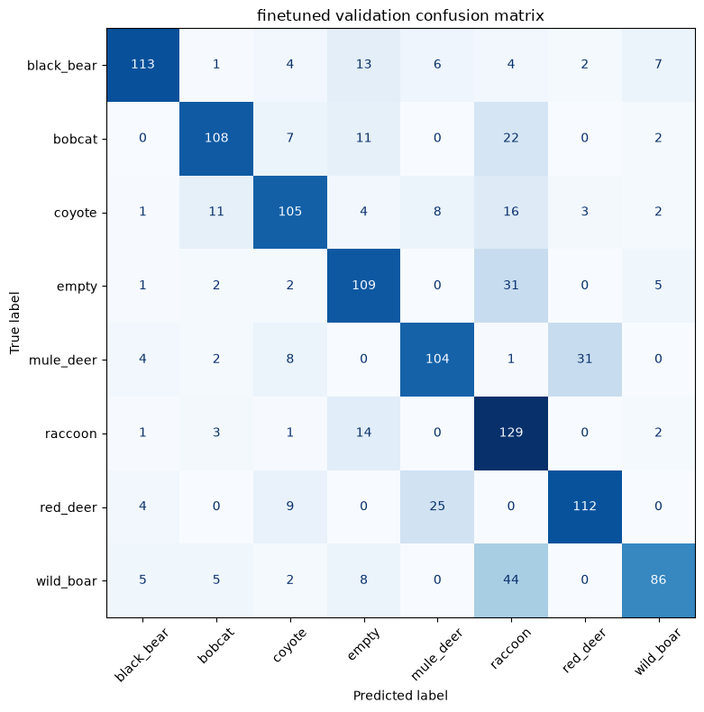
    


```python
cm_norm = confusion_matrix(y_val_true, y_val_pred, normalize="true")

fig, ax = plt.subplots(figsize=(8, 8))
disp = ConfusionMatrixDisplay(confusion_matrix=cm_norm, display_labels=class_names)
disp.plot(ax=ax, cmap="Blues", xticks_rotation=45, values_format=".2f", colorbar=False)
ax.set_title(f"{selected_model_name} validation confusion matrix, normalized")
plt.tight_layout()
fig.savefig(FIGURES_DIR / f"04_{selected_model_name}_val_confusion_matrix_normalized.png", dpi=200, bbox_inches="tight")
plt.show()

```


    
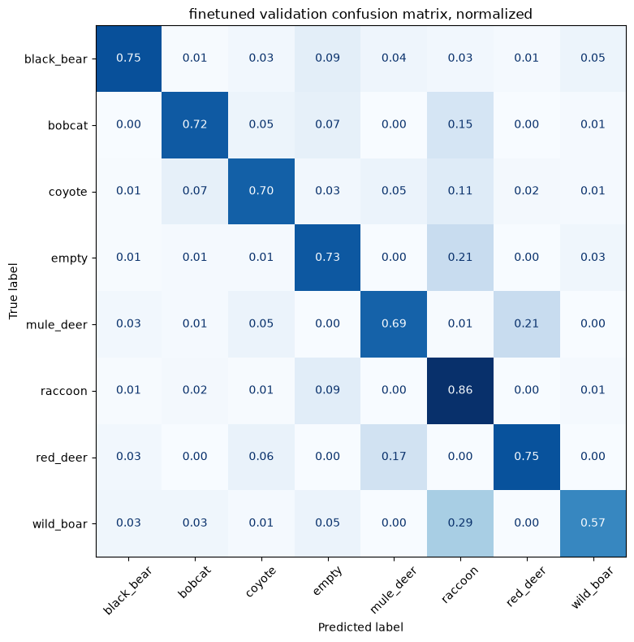
    


## 8. Class-level error analysis


```python
class_report_df = report_df.loc[class_names, ["precision", "recall", "f1-score", "support"]].copy()
class_report_df = class_report_df.rename(columns={"f1-score": "f1"})

false_positives = cm.sum(axis=0) - np.diag(cm)
false_negatives = cm.sum(axis=1) - np.diag(cm)

class_summary_df = class_report_df.reset_index(names="class_name")
class_summary_df["support"] = class_summary_df["support"].astype(int)
class_summary_df["false_positives"] = false_positives
class_summary_df["false_negatives"] = false_negatives
class_summary_df = class_summary_df.sort_values("f1", ascending=True).reset_index(drop=True)

class_summary_df.to_csv(REPORTS_DIR / "error_analysis_class_summary.csv", index=False)
display(class_summary_df)

```


<div>
<style scoped>
    .dataframe tbody tr th:only-of-type {
        vertical-align: middle;
    }

    .dataframe tbody tr th {
        vertical-align: top;
    }

    .dataframe thead th {
        text-align: right;
    }
</style>
<table border="1" class="dataframe">
  <thead>
    <tr style="text-align: right;">
      <th></th>
      <th>class_name</th>
      <th>precision</th>
      <th>recall</th>
      <th>f1</th>
      <th>support</th>
      <th>false_positives</th>
      <th>false_negatives</th>
    </tr>
  </thead>
  <tbody>
    <tr>
      <th>0</th>
      <td>raccoon</td>
      <td>0.522267</td>
      <td>0.860000</td>
      <td>0.649874</td>
      <td>150</td>
      <td>118</td>
      <td>21</td>
    </tr>
    <tr>
      <th>1</th>
      <td>wild_boar</td>
      <td>0.826923</td>
      <td>0.573333</td>
      <td>0.677165</td>
      <td>150</td>
      <td>18</td>
      <td>64</td>
    </tr>
    <tr>
      <th>2</th>
      <td>empty</td>
      <td>0.685535</td>
      <td>0.726667</td>
      <td>0.705502</td>
      <td>150</td>
      <td>50</td>
      <td>41</td>
    </tr>
    <tr>
      <th>3</th>
      <td>mule_deer</td>
      <td>0.727273</td>
      <td>0.693333</td>
      <td>0.709898</td>
      <td>150</td>
      <td>39</td>
      <td>46</td>
    </tr>
    <tr>
      <th>4</th>
      <td>coyote</td>
      <td>0.760870</td>
      <td>0.700000</td>
      <td>0.729167</td>
      <td>150</td>
      <td>33</td>
      <td>45</td>
    </tr>
    <tr>
      <th>5</th>
      <td>red_deer</td>
      <td>0.756757</td>
      <td>0.746667</td>
      <td>0.751678</td>
      <td>150</td>
      <td>36</td>
      <td>38</td>
    </tr>
    <tr>
      <th>6</th>
      <td>bobcat</td>
      <td>0.818182</td>
      <td>0.720000</td>
      <td>0.765957</td>
      <td>150</td>
      <td>24</td>
      <td>42</td>
    </tr>
    <tr>
      <th>7</th>
      <td>black_bear</td>
      <td>0.875969</td>
      <td>0.753333</td>
      <td>0.810036</td>
      <td>150</td>
      <td>16</td>
      <td>37</td>
    </tr>
  </tbody>
</table>
</div>


Weak classes at the top are the first candidates for targeted data review and augmentation.


## 9. Most common confusion pairs


```python
incorrect_df = val_results_df[~val_results_df["correct"]].copy()

confusion_pairs_df = (
    incorrect_df.groupby(["true_label", "pred_label"])
    .size()
    .reset_index(name="count")
    .sort_values("count", ascending=False)
    .reset_index(drop=True)
)

confusion_pairs_df.to_csv(REPORTS_DIR / "error_analysis_confusion_pairs.csv", index=False)
display(confusion_pairs_df.head(15))

```


<div>
<style scoped>
    .dataframe tbody tr th:only-of-type {
        vertical-align: middle;
    }

    .dataframe tbody tr th {
        vertical-align: top;
    }

    .dataframe thead th {
        text-align: right;
    }
</style>
<table border="1" class="dataframe">
  <thead>
    <tr style="text-align: right;">
      <th></th>
      <th>true_label</th>
      <th>pred_label</th>
      <th>count</th>
    </tr>
  </thead>
  <tbody>
    <tr>
      <th>0</th>
      <td>wild_boar</td>
      <td>raccoon</td>
      <td>44</td>
    </tr>
    <tr>
      <th>1</th>
      <td>mule_deer</td>
      <td>red_deer</td>
      <td>31</td>
    </tr>
    <tr>
      <th>2</th>
      <td>empty</td>
      <td>raccoon</td>
      <td>31</td>
    </tr>
    <tr>
      <th>3</th>
      <td>red_deer</td>
      <td>mule_deer</td>
      <td>25</td>
    </tr>
    <tr>
      <th>4</th>
      <td>bobcat</td>
      <td>raccoon</td>
      <td>22</td>
    </tr>
    <tr>
      <th>5</th>
      <td>coyote</td>
      <td>raccoon</td>
      <td>16</td>
    </tr>
    <tr>
      <th>6</th>
      <td>raccoon</td>
      <td>empty</td>
      <td>14</td>
    </tr>
    <tr>
      <th>7</th>
      <td>black_bear</td>
      <td>empty</td>
      <td>13</td>
    </tr>
    <tr>
      <th>8</th>
      <td>coyote</td>
      <td>bobcat</td>
      <td>11</td>
    </tr>
    <tr>
      <th>9</th>
      <td>bobcat</td>
      <td>empty</td>
      <td>11</td>
    </tr>
    <tr>
      <th>10</th>
      <td>red_deer</td>
      <td>coyote</td>
      <td>9</td>
    </tr>
    <tr>
      <th>11</th>
      <td>coyote</td>
      <td>mule_deer</td>
      <td>8</td>
    </tr>
    <tr>
      <th>12</th>
      <td>wild_boar</td>
      <td>empty</td>
      <td>8</td>
    </tr>
    <tr>
      <th>13</th>
      <td>mule_deer</td>
      <td>coyote</td>
      <td>8</td>
    </tr>
    <tr>
      <th>14</th>
      <td>bobcat</td>
      <td>coyote</td>
      <td>7</td>
    </tr>
  </tbody>
</table>
</div>


Top confusion pairs show where visually similar species or background shortcuts are hurting accuracy.


## 10. Visual inspection of difficult examples


```python
def show_prediction_examples(
    results_df,
    correct=False,
    n=12,
    sort_by="confidence",
    ascending=False,
    ncols=3,
    save_path=None,
):
    examples = results_df[results_df["correct"] == correct].copy()

    if sort_by in examples.columns:
        examples = examples.sort_values(sort_by, ascending=ascending)

    examples = examples.head(n)

    if examples.empty:
        print("No examples to show.")
        return None

    nrows = int(np.ceil(len(examples) / ncols))
    fig, axes = plt.subplots(
        nrows=nrows,
        ncols=ncols,
        figsize=(4.2 * ncols, 4.8 * nrows),
    )
    axes = np.array(axes).reshape(-1)

    for ax, (_, row) in zip(axes, examples.iterrows()):
        image = plt.imread(row["image_path"])
        ax.imshow(image)
        ax.set_title(
            f"True: {row['true_label']}\n"
            f"Pred: {row['pred_label']}\n"
            f"Conf: {row['confidence']:.2f} | Margin: {row['prediction_margin']:.2f}",
            fontsize=10,
            pad=8,
        )
        ax.axis("off")

    for ax in axes[len(examples):]:
        ax.axis("off")

    plt.tight_layout(h_pad=3.0, w_pad=1.5)

    if save_path is not None:
        fig.savefig(save_path, dpi=200, bbox_inches="tight")

    plt.show()
    return fig

```


```python
show_prediction_examples(
    val_results_df,
    correct=False,
    n=12,
    sort_by="confidence",
    ascending=False,
    ncols=3,
    save_path=FIGURES_DIR / f"04_{selected_model_name}_most_confident_mistakes.png",
)

```


    
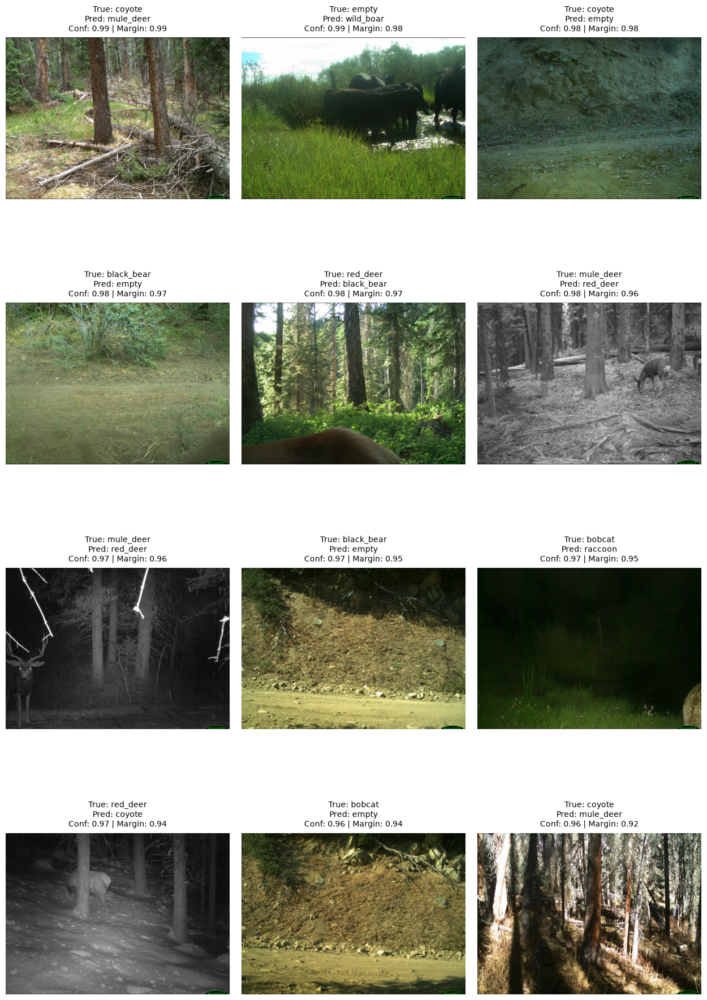
    


    

    


```python
show_prediction_examples(
    val_results_df,
    correct=False,
    n=12,
    sort_by="prediction_margin",
    ascending=True,
    ncols=3,
    save_path=FIGURES_DIR / f"04_{selected_model_name}_ambiguous_mistakes.png",
)

```


    
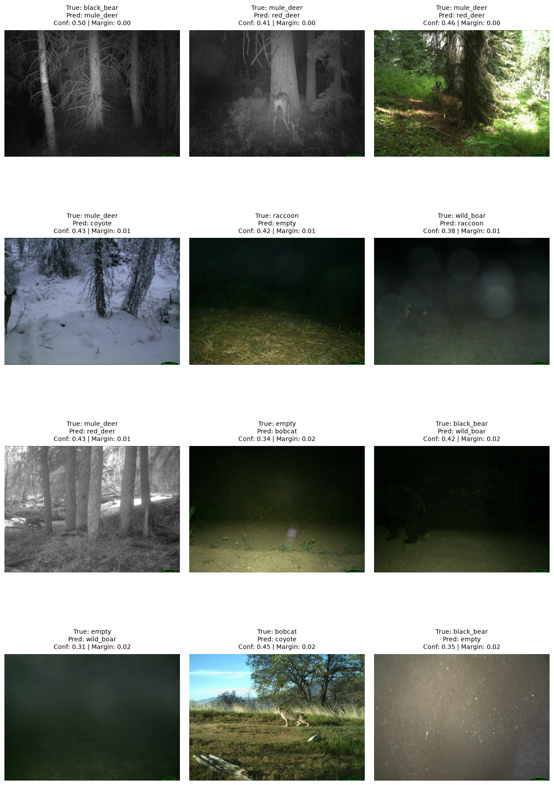
    


    

    


```python
show_prediction_examples(
    val_results_df,
    correct=True,
    n=12,
    sort_by="confidence",
    ascending=True,
    ncols=3,
    save_path=FIGURES_DIR / f"04_{selected_model_name}_low_confidence_correct.png",
)

```


    

    


    
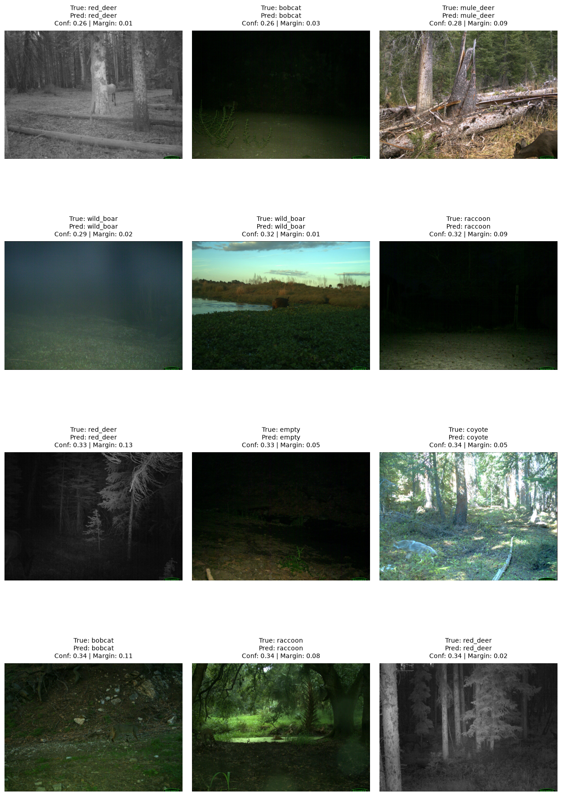
    


## 11. Empty vs non-empty analysis


```python
val_results_df["true_binary"] = np.where(val_results_df["true_label"] == "empty", "empty", "non_empty")
val_results_df["pred_binary"] = np.where(val_results_df["pred_label"] == "empty", "empty", "non_empty")

binary_labels = ["empty", "non_empty"]
binary_accuracy = accuracy_score(val_results_df["true_binary"], val_results_df["pred_binary"])
binary_cm = confusion_matrix(
    val_results_df["true_binary"],
    val_results_df["pred_binary"],
    labels=binary_labels,
)

false_empty_df = val_results_df[
    (val_results_df["true_binary"] == "non_empty")
    & (val_results_df["pred_binary"] == "empty")
].copy()
false_animal_df = val_results_df[
    (val_results_df["true_binary"] == "empty")
    & (val_results_df["pred_binary"] == "non_empty")
].copy()

print(f"Binary empty/non-empty accuracy: {binary_accuracy:.4f}")
print(f"Animal predicted as empty: {len(false_empty_df)}")
print(f"Empty predicted as animal: {len(false_animal_df)}")

fig, ax = plt.subplots(figsize=(5, 5))
disp = ConfusionMatrixDisplay(confusion_matrix=binary_cm, display_labels=binary_labels)
disp.plot(ax=ax, cmap="Blues", colorbar=False)
ax.set_title("Empty vs non-empty confusion matrix")
plt.tight_layout()
plt.show()

```

    Binary empty/non-empty accuracy: 0.9242
    Animal predicted as empty: 50
    Empty predicted as animal: 41


    
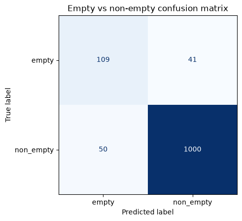
    


```python
show_prediction_examples(
    false_empty_df,
    correct=False,
    n=6,
    sort_by="confidence",
    ascending=False,
    ncols=3,
)

```


    
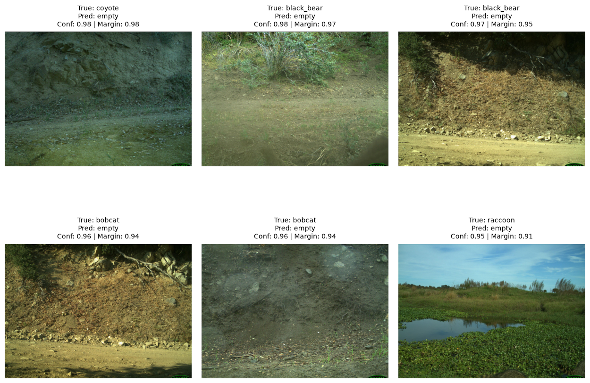
    


    

    


```python
show_prediction_examples(
    false_animal_df,
    correct=False,
    n=6,
    sort_by="confidence",
    ascending=False,
    ncols=3,
)

```


    

    


    
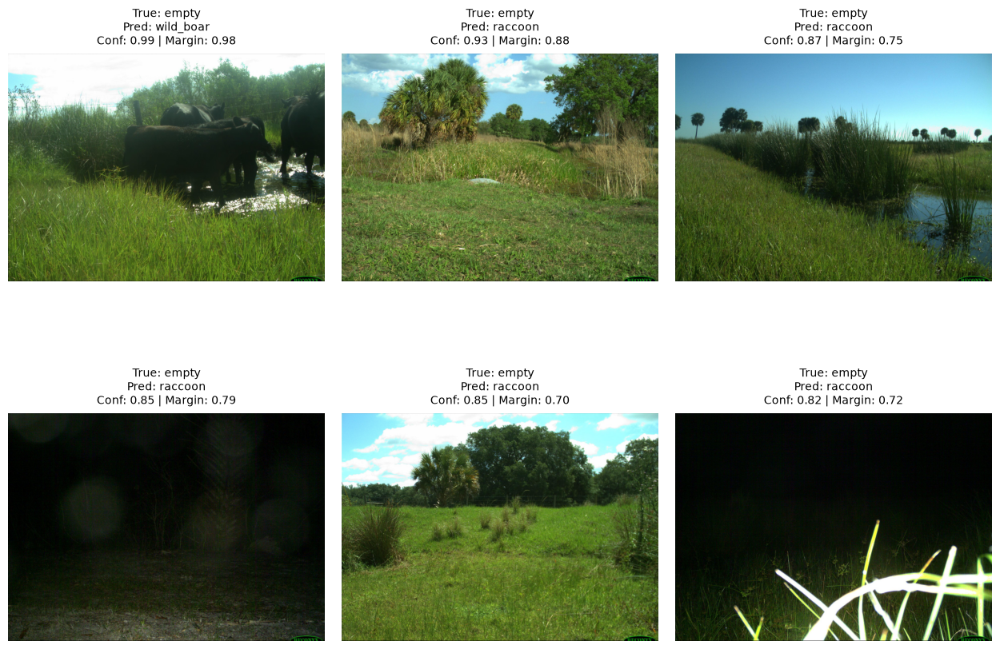
    


Empty/non-empty mistakes indicate whether localization or a separate detector could improve the classifier.


## 12. Confidence analysis


```python
fig, ax = plt.subplots(figsize=(7, 4))
ax.hist(
    val_results_df.loc[val_results_df["correct"], "confidence"],
    bins=15,
    alpha=0.65,
    label="correct",
)
ax.hist(
    val_results_df.loc[~val_results_df["correct"], "confidence"],
    bins=15,
    alpha=0.65,
    label="incorrect",
)
ax.set_xlabel("Confidence")
ax.set_ylabel("Number of images")
ax.set_title("Confidence for correct and incorrect predictions")
ax.legend()
plt.tight_layout()
fig.savefig(FIGURES_DIR / "04_confidence_correct_vs_incorrect.png", dpi=200, bbox_inches="tight")
plt.show()

```


    
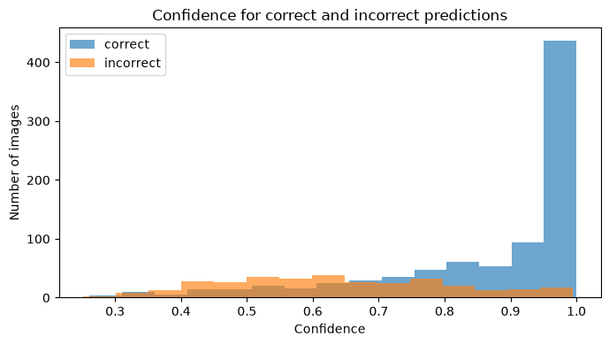
    


```python
confidence_bins = pd.IntervalIndex.from_tuples(
    [(0.0, 0.2), (0.2, 0.4), (0.4, 0.6), (0.6, 0.8), (0.8, 1.0)],
    closed="right",
)

confidence_df = val_results_df.copy()
confidence_df["confidence_bin"] = pd.cut(confidence_df["confidence"], bins=confidence_bins)
accuracy_by_bin = (
    confidence_df.groupby("confidence_bin", observed=False)
    .agg(accuracy=("correct", "mean"), count=("correct", "size"))
    .reset_index()
)

fig, ax = plt.subplots(figsize=(7, 4))
ax.bar(accuracy_by_bin["confidence_bin"].astype(str), accuracy_by_bin["accuracy"])
ax.set_ylim(0, 1)
ax.set_xlabel("Confidence bin")
ax.set_ylabel("Accuracy")
ax.set_title("Accuracy by confidence bin")
plt.xticks(rotation=30, ha="right")
plt.tight_layout()
fig.savefig(FIGURES_DIR / "04_accuracy_by_confidence_bin.png", dpi=200, bbox_inches="tight")
plt.show()

display(accuracy_by_bin)

```


    
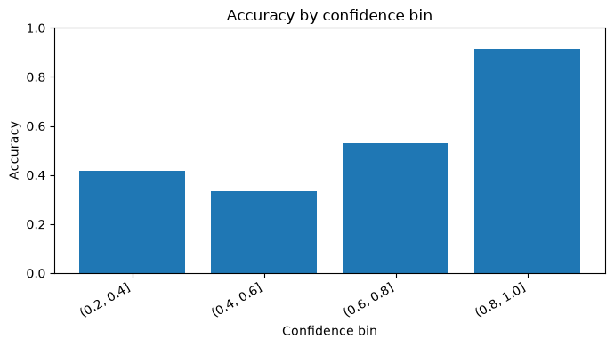
    


<div>
<style scoped>
    .dataframe tbody tr th:only-of-type {
        vertical-align: middle;
    }

    .dataframe tbody tr th {
        vertical-align: top;
    }

    .dataframe thead th {
        text-align: right;
    }
</style>
<table border="1" class="dataframe">
  <thead>
    <tr style="text-align: right;">
      <th></th>
      <th>confidence_bin</th>
      <th>accuracy</th>
      <th>count</th>
    </tr>
  </thead>
  <tbody>
    <tr>
      <th>0</th>
      <td>(0.0, 0.2]</td>
      <td>NaN</td>
      <td>0</td>
    </tr>
    <tr>
      <th>1</th>
      <td>(0.2, 0.4]</td>
      <td>0.418605</td>
      <td>43</td>
    </tr>
    <tr>
      <th>2</th>
      <td>(0.4, 0.6]</td>
      <td>0.335135</td>
      <td>185</td>
    </tr>
    <tr>
      <th>3</th>
      <td>(0.6, 0.8]</td>
      <td>0.530303</td>
      <td>264</td>
    </tr>
    <tr>
      <th>4</th>
      <td>(0.8, 1.0]</td>
      <td>0.912429</td>
      <td>708</td>
    </tr>
  </tbody>
</table>
</div>


```python
boxplot_data = [
    val_results_df.loc[val_results_df["true_label"] == class_name, "confidence"]
    for class_name in class_names
]

fig, ax = plt.subplots(figsize=(9, 4.5))
ax.boxplot(boxplot_data, tick_labels=class_names, showfliers=False)
ax.set_xlabel("True class")
ax.set_ylabel("Confidence")
ax.set_title("Confidence by true class")
plt.xticks(rotation=45, ha="right")
plt.tight_layout()
plt.show()

```


    
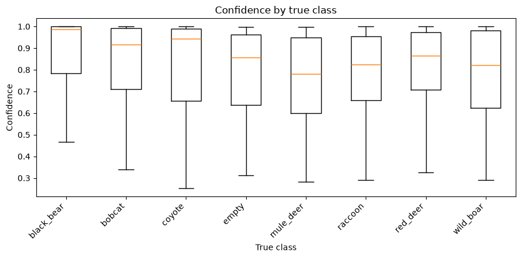
    


High-confidence mistakes and low-confidence correct predictions are the best images to inspect before choosing the next experiment.


## 13. Grad-CAM setup


```python
def get_mobilenet_backbone(model, last_conv_layer_name="Conv_1"):
    matches = []
    for layer in model.layers:
        if "mobilenetv2" not in layer.name.lower():
            continue
        if not hasattr(layer, "get_layer"):
            continue
        try:
            layer.get_layer(last_conv_layer_name)
        except ValueError:
            continue
        matches.append(layer)

    if not matches:
        layer_names = [layer.name for layer in model.layers]
        raise ValueError(
            f"No MobileNetV2 backbone containing {last_conv_layer_name!r} found. "
            f"Top-level layers: {layer_names}"
        )
    return matches[0]


def call_layer(layer, x):
    try:
        return layer(x, training=False)
    except TypeError:
        return layer(x)


def make_gradcam_heatmap(
    image_array,
    model,
    backbone_layer_name="mobilenetv2_1.00_224",
    last_conv_layer_name="Conv_1",
    pred_index=None,
):
    backbone = model.get_layer(backbone_layer_name)
    if not hasattr(backbone, "get_layer"):
        raise TypeError(
            f"Layer {backbone_layer_name!r} is a {type(backbone).__name__}, "
            "not the nested MobileNetV2 backbone."
        )
    last_conv_layer = backbone.get_layer(last_conv_layer_name)
    conv_model = keras.Model(
        backbone.input,
        [last_conv_layer.output, backbone.output],
    )

    backbone_index = model.layers.index(backbone)
    pre_backbone_layers = model.layers[1:backbone_index]
    post_backbone_layers = model.layers[backbone_index + 1:]

    image_tensor = tf.convert_to_tensor(image_array, dtype=tf.float32)

    with tf.GradientTape() as tape:
        x = image_tensor
        for layer in pre_backbone_layers:
            x = call_layer(layer, x)

        conv_outputs, x = conv_model(x)
        tape.watch(conv_outputs)

        for layer in post_backbone_layers:
            x = call_layer(layer, x)

        predictions = x
        if pred_index is None:
            pred_index = tf.argmax(predictions[0])
        class_channel = predictions[:, pred_index]

    grads = tape.gradient(class_channel, conv_outputs)
    pooled_grads = tf.reduce_mean(grads, axis=(0, 1, 2))

    conv_outputs = conv_outputs[0]
    heatmap = conv_outputs @ pooled_grads[..., tf.newaxis]
    heatmap = tf.squeeze(heatmap)
    heatmap = tf.maximum(heatmap, 0)
    heatmap = heatmap / (tf.reduce_max(heatmap) + 1e-8)

    return heatmap.numpy()


def overlay_heatmap(image, heatmap, alpha=0.4):
    image = np.asarray(image)
    if image.max() > 1:
        image = image / 255.0

    heatmap = tf.image.resize(heatmap[..., np.newaxis], image.shape[:2]).numpy().squeeze()
    cmap = plt.get_cmap("jet")
    heatmap_rgb = cmap(heatmap)[..., :3]

    overlay = (1 - alpha) * image + alpha * heatmap_rgb
    return np.clip(overlay, 0, 1)


def show_gradcam_examples(
    results_df,
    model,
    n=6,
    correct=False,
    sort_by="confidence",
    ascending=False,
    save_path=None,
):
    backbone = get_mobilenet_backbone(model)
    examples = results_df[results_df["correct"] == correct].copy()

    if sort_by in examples.columns:
        examples = examples.sort_values(sort_by, ascending=ascending)

    examples = examples.head(n)

    if examples.empty:
        print("No examples to show.")
        return None

    fig, axes = plt.subplots(
        nrows=len(examples),
        ncols=2,
        figsize=(8, 3.6 * len(examples)),
    )
    axes = np.array(axes).reshape(len(examples), 2)

    for row_idx, (_, row) in enumerate(examples.iterrows()):
        image = load_image_array(row["image_path"])
        heatmap = make_gradcam_heatmap(
            image[np.newaxis, ...],
            model,
            backbone_layer_name=backbone.name,
            last_conv_layer_name="Conv_1",
            pred_index=int(row["pred_idx"]),
        )
        overlay = overlay_heatmap(image, heatmap)

        title = (
            f"True: {row['true_label']} | Pred: {row['pred_label']}\n"
            f"Conf: {row['confidence']:.2f}"
        )

        axes[row_idx, 0].imshow(image)
        axes[row_idx, 0].set_title(title, fontsize=10, pad=8)
        axes[row_idx, 0].axis("off")

        axes[row_idx, 1].imshow(overlay)
        axes[row_idx, 1].set_title("Grad-CAM", fontsize=10, pad=8)
        axes[row_idx, 1].axis("off")

    plt.tight_layout(h_pad=2.0, w_pad=1.0)

    if save_path is not None:
        fig.savefig(save_path, dpi=200, bbox_inches="tight")

    plt.show()
    return fig

```

## 14. Grad-CAM examples


```python
show_gradcam_examples(
    val_results_df,
    model,
    n=6,
    correct=False,
    sort_by="confidence",
    ascending=False,
    save_path=FIGURES_DIR / f"04_{selected_model_name}_gradcam_confident_mistakes.png",
)

```


    

    


    
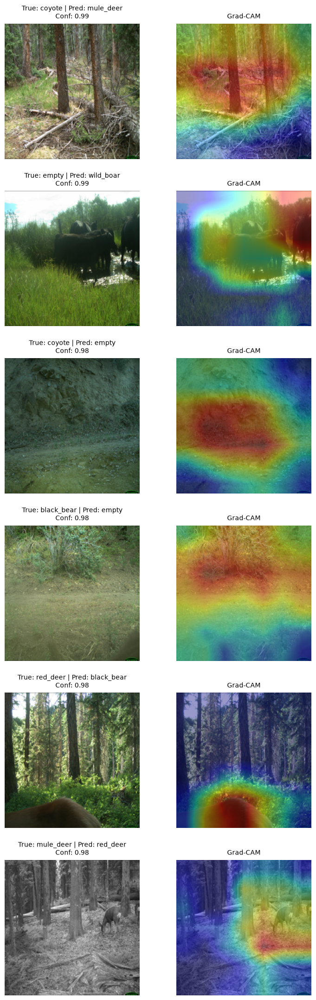
    


```python
show_gradcam_examples(
    val_results_df,
    model,
    n=6,
    correct=True,
    sort_by="confidence",
    ascending=True,
    save_path=FIGURES_DIR / f"04_{selected_model_name}_gradcam_low_confidence_correct.png",
)

```


    

    


    
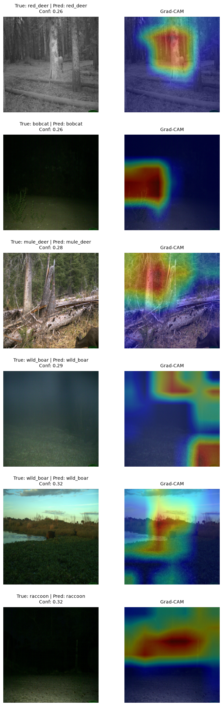
    


```python
show_gradcam_examples(
    false_empty_df,
    model,
    n=3,
    correct=False,
    sort_by="confidence",
    ascending=False,
)

```


    

    


    
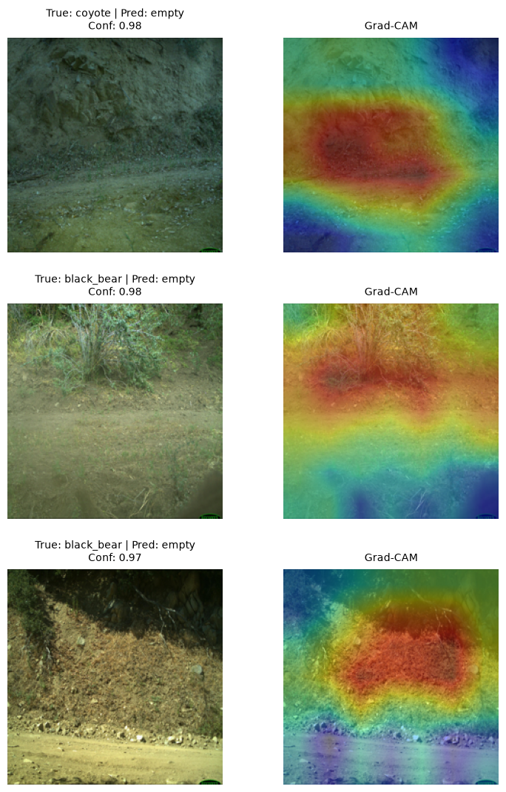
    


```python
show_gradcam_examples(
    false_animal_df,
    model,
    n=3,
    correct=False,
    sort_by="confidence",
    ascending=False,
)

```


    
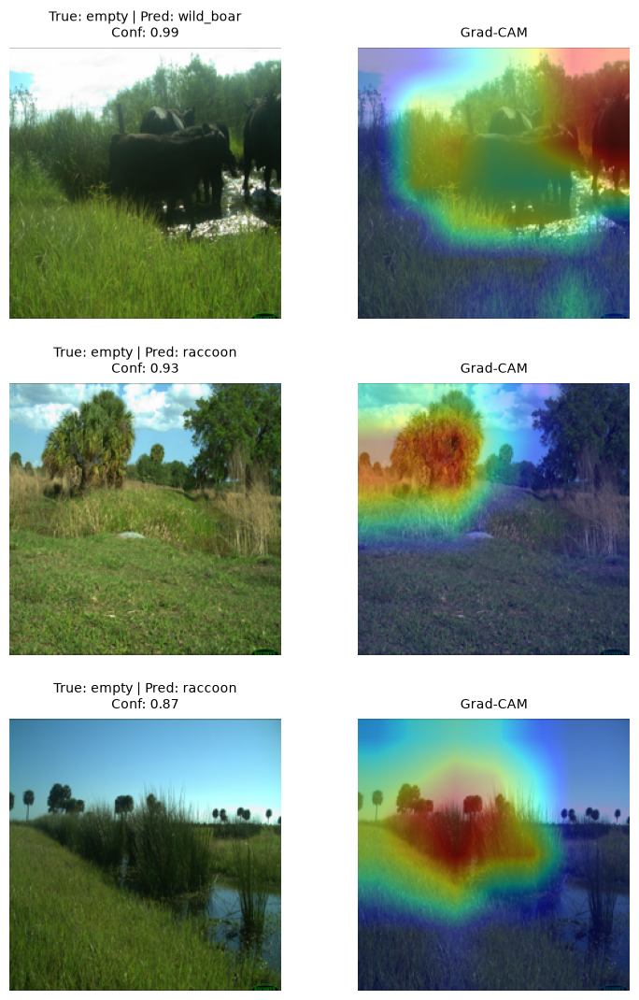
    


    

    


```python
if not confusion_pairs_df.empty:
    top_pair = confusion_pairs_df.iloc[0]
    pair_df = val_results_df[
        (val_results_df["true_label"] == top_pair["true_label"])
        & (val_results_df["pred_label"] == top_pair["pred_label"])
    ]
    print(f"Top pair: {top_pair['true_label']} predicted as {top_pair['pred_label']}")
    show_gradcam_examples(
        pair_df,
        model,
        n=3,
        correct=False,
        sort_by="confidence",
        ascending=False,
    )

```

    Top pair: wild_boar predicted as raccoon


    
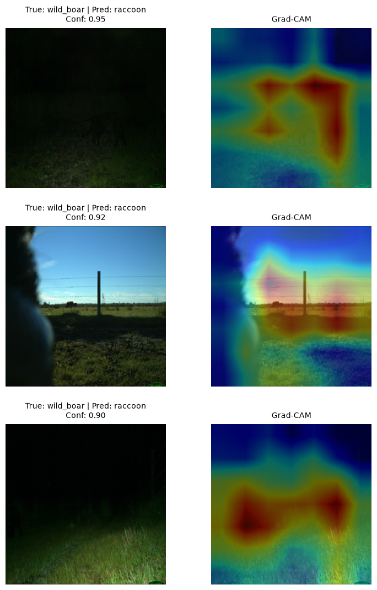
    


Grad-CAM is most useful when it shows whether the model looked at the animal or at camera context/background.


## 15. Practical conclusions


```python
top_confusions = confusion_pairs_df.head(5).copy()
weak_classes = class_summary_df.head(3).copy()
high_conf_error_rate = (
    val_results_df.loc[~val_results_df["correct"], "confidence"].ge(0.8).mean()
    if len(incorrect_df) else 0
)

print("Most confused class pairs:")
display(top_confusions)

print("Weakest classes by F1:")
display(weak_classes[["class_name", "precision", "recall", "f1", "false_positives", "false_negatives"]])

print("Interpret after inspecting the examples above:")
print("- Small or occluded animals -> try higher image resolution and object localization/detection.")
print("- Night/IR or cluttered backgrounds -> add targeted augmentation and review labels.")
print("- Visually similar species -> try a stronger pretrained backbone and class-pair focused augmentation.")
print("- Many confident background-focused mistakes -> prioritize detection/localization before more classifier tuning.")
print(f"High-confidence mistake share among mistakes: {high_conf_error_rate:.2%}")

```

    Most confused class pairs:


<div>
<style scoped>
    .dataframe tbody tr th:only-of-type {
        vertical-align: middle;
    }

    .dataframe tbody tr th {
        vertical-align: top;
    }

    .dataframe thead th {
        text-align: right;
    }
</style>
<table border="1" class="dataframe">
  <thead>
    <tr style="text-align: right;">
      <th></th>
      <th>true_label</th>
      <th>pred_label</th>
      <th>count</th>
    </tr>
  </thead>
  <tbody>
    <tr>
      <th>0</th>
      <td>wild_boar</td>
      <td>raccoon</td>
      <td>44</td>
    </tr>
    <tr>
      <th>1</th>
      <td>mule_deer</td>
      <td>red_deer</td>
      <td>31</td>
    </tr>
    <tr>
      <th>2</th>
      <td>empty</td>
      <td>raccoon</td>
      <td>31</td>
    </tr>
    <tr>
      <th>3</th>
      <td>red_deer</td>
      <td>mule_deer</td>
      <td>25</td>
    </tr>
    <tr>
      <th>4</th>
      <td>bobcat</td>
      <td>raccoon</td>
      <td>22</td>
    </tr>
  </tbody>
</table>
</div>


    Weakest classes by F1:


<div>
<style scoped>
    .dataframe tbody tr th:only-of-type {
        vertical-align: middle;
    }

    .dataframe tbody tr th {
        vertical-align: top;
    }

    .dataframe thead th {
        text-align: right;
    }
</style>
<table border="1" class="dataframe">
  <thead>
    <tr style="text-align: right;">
      <th></th>
      <th>class_name</th>
      <th>precision</th>
      <th>recall</th>
      <th>f1</th>
      <th>false_positives</th>
      <th>false_negatives</th>
    </tr>
  </thead>
  <tbody>
    <tr>
      <th>0</th>
      <td>raccoon</td>
      <td>0.522267</td>
      <td>0.860000</td>
      <td>0.649874</td>
      <td>118</td>
      <td>21</td>
    </tr>
    <tr>
      <th>1</th>
      <td>wild_boar</td>
      <td>0.826923</td>
      <td>0.573333</td>
      <td>0.677165</td>
      <td>18</td>
      <td>64</td>
    </tr>
    <tr>
      <th>2</th>
      <td>empty</td>
      <td>0.685535</td>
      <td>0.726667</td>
      <td>0.705502</td>
      <td>50</td>
      <td>41</td>
    </tr>
  </tbody>
</table>
</div>


    Interpret after inspecting the examples above:
    - Small or occluded animals -> try higher image resolution and object localization/detection.
    - Night/IR or cluttered backgrounds -> add targeted augmentation and review labels.
    - Visually similar species -> try a stronger pretrained backbone and class-pair focused augmentation.
    - Many confident background-focused mistakes -> prioritize detection/localization before more classifier tuning.
    High-confidence mistake share among mistakes: 18.56%

