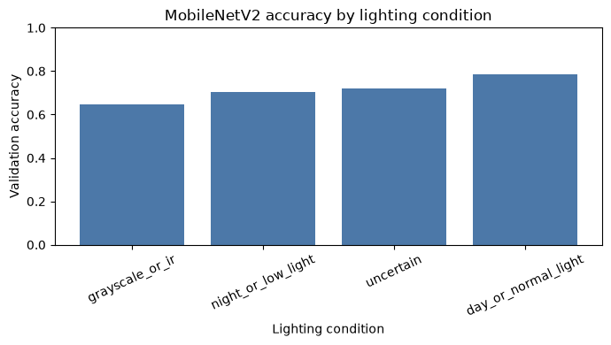
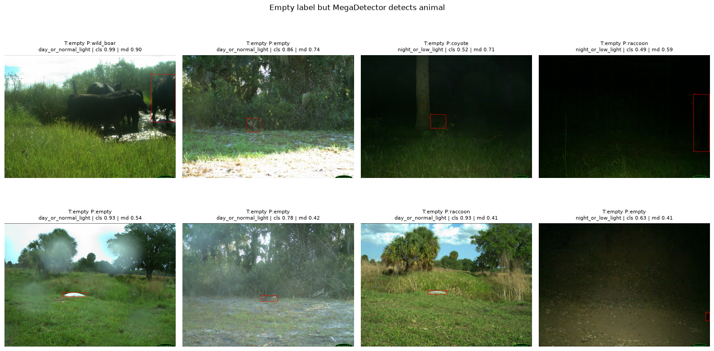
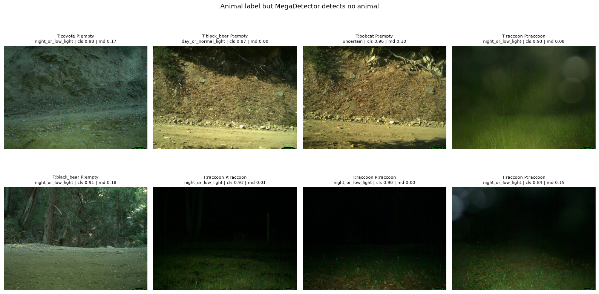
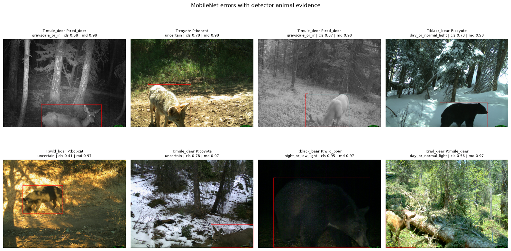
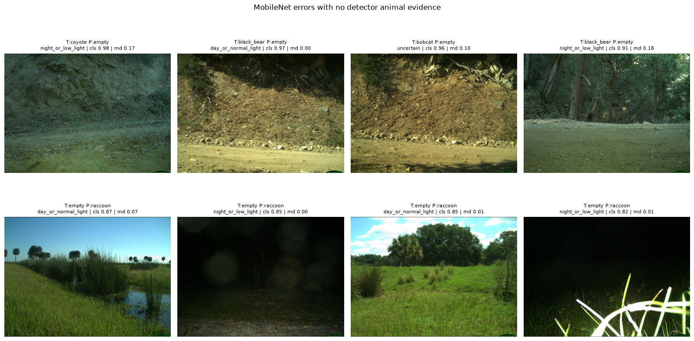

# 05b — Lighting and Detector Analysis

Analyze MobileNetV2 validation predictions together with lighting labels and flattened MegaDetector outputs.

## 1. Configuration


```python
from pathlib import Path
import sys
import random

import numpy as np
import pandas as pd
import matplotlib.pyplot as plt
from PIL import Image, ImageDraw

import tensorflow as tf
from tensorflow import keras

from sklearn.metrics import accuracy_score, f1_score, classification_report, confusion_matrix, ConfusionMatrixDisplay

SEED = 42
random.seed(SEED)
np.random.seed(SEED)
tf.random.set_seed(SEED)

PROJECT_ROOT = Path.cwd()
if not (PROJECT_ROOT / "data").exists():
    PROJECT_ROOT = PROJECT_ROOT.parent

if str(PROJECT_ROOT.resolve()) not in sys.path:
    sys.path.append(str(PROJECT_ROOT.resolve()))

from src.download_data import READABLE_LABELS

DATA_DIR = PROJECT_ROOT / "data"
METADATA_DIR = DATA_DIR / "metadata"
MODELS_DIR = PROJECT_ROOT / "models"
REPORTS_DIR = PROJECT_ROOT / "reports"
FIGURES_DIR = REPORTS_DIR / "figures"

VAL_CSV = METADATA_DIR / "val_1000.csv"
BEST_MODEL_PATH = MODELS_DIR / "mobilenetv2_finetuned_1000_per_class.keras"
VAL_PREDICTIONS_PATH = REPORTS_DIR / "05b_val_predictions_finetuned_1000_per_class.csv"
LIGHTING_PATH = REPORTS_DIR / "05b_val_lighting_labels.csv"
MD_CSV_PATH = REPORTS_DIR / "megadetector_val_results.csv"
SUMMARY_PATH = REPORTS_DIR / "05b_summary.csv"

IMG_SIZE = (224, 224)
BATCH_SIZE = 64

REPORTS_DIR.mkdir(parents=True, exist_ok=True)
FIGURES_DIR.mkdir(parents=True, exist_ok=True)

print(f"Project root: {PROJECT_ROOT.resolve()}")
print(f"Validation metadata: {VAL_CSV}")
print(f"Model: {BEST_MODEL_PATH}")
print(f"MegaDetector CSV: {MD_CSV_PATH}")
```

    Project root: /Users/mihnea/Desktop/Proiecte personale/wildlife-image-classification
    Validation metadata: /Users/mihnea/Desktop/Proiecte personale/wildlife-image-classification/data/metadata/val_1000.csv
    Model: /Users/mihnea/Desktop/Proiecte personale/wildlife-image-classification/models/mobilenetv2_finetuned_1000_per_class.keras
    MegaDetector CSV: /Users/mihnea/Desktop/Proiecte personale/wildlife-image-classification/reports/megadetector_val_results.csv


## 2. Load Validation Metadata


```python
val_df = pd.read_csv(VAL_CSV)
if "readable_label" not in val_df.columns:
    val_df["readable_label"] = val_df["label"].map(READABLE_LABELS)

class_names = sorted(val_df["readable_label"].dropna().unique())
label_to_idx = {label: idx for idx, label in enumerate(class_names)}
idx_to_label = {idx: label for label, idx in label_to_idx.items()}
val_df["label_idx"] = val_df["readable_label"].map(label_to_idx)


def resolve_image_path(row):
    if "cropped_path_rel" in row and pd.notna(row["cropped_path_rel"]):
        return PROJECT_ROOT / row["cropped_path_rel"]
    if "cropped_path" in row and pd.notna(row["cropped_path"]):
        path = Path(row["cropped_path"])
        return path if path.is_absolute() else PROJECT_ROOT / path
    raise ValueError("No cropped image path found for row.")


val_df["image_path"] = val_df.apply(resolve_image_path, axis=1)
missing_paths = val_df.loc[~val_df["image_path"].map(Path.exists), "image_path"]
if len(missing_paths) > 0:
    raise FileNotFoundError(f"Missing {len(missing_paths)} validation images. First missing path: {missing_paths.iloc[0]}")

print(f"Validation images: {len(val_df)}")
print(f"Classes: {class_names}")
val_df[["image_id", "readable_label", "image_path"]].head()
```

    Validation images: 1200
    Classes: ['black_bear', 'bobcat', 'coyote', 'empty', 'mule_deer', 'raccoon', 'red_deer', 'wild_boar']


<div>
<style scoped>
    .dataframe tbody tr th:only-of-type {
        vertical-align: middle;
    }

    .dataframe tbody tr th {
        vertical-align: top;
    }

    .dataframe thead th {
        text-align: right;
    }
</style>
<table border="1" class="dataframe">
  <thead>
    <tr style="text-align: right;">
      <th></th>
      <th>image_id</th>
      <th>readable_label</th>
      <th>image_path</th>
    </tr>
  </thead>
  <tbody>
    <tr>
      <th>0</th>
      <td>2010_Unit170_Ivan045_img0945.jpg</td>
      <td>mule_deer</td>
      <td>/Users/mihnea/Desktop/Proiecte personale/wildl...</td>
    </tr>
    <tr>
      <th>1</th>
      <td>FL-38_11_03_2015_FL-38_0003815.jpg</td>
      <td>bobcat</td>
      <td>/Users/mihnea/Desktop/Proiecte personale/wildl...</td>
    </tr>
    <tr>
      <th>2</th>
      <td>2015_Unit009_Ivan052_img0113.jpg</td>
      <td>coyote</td>
      <td>/Users/mihnea/Desktop/Proiecte personale/wildl...</td>
    </tr>
    <tr>
      <th>3</th>
      <td>FL-01_09_02_2015_FL-01_0037608.jpg</td>
      <td>bobcat</td>
      <td>/Users/mihnea/Desktop/Proiecte personale/wildl...</td>
    </tr>
    <tr>
      <th>4</th>
      <td>CA-38_10_07_2015_CA-38_0023157.jpg</td>
      <td>black_bear</td>
      <td>/Users/mihnea/Desktop/Proiecte personale/wildl...</td>
    </tr>
  </tbody>
</table>
</div>


## 3. MobileNetV2 Validation Predictions


```python
def load_image_array(image_path, image_size=IMG_SIZE):
    image = Image.open(image_path).convert("RGB")
    image = image.resize(image_size)
    return np.asarray(image, dtype=np.float32) / 255.0


class ImageSequence(keras.utils.Sequence):
    def __init__(self, df, batch_size=32, image_size=IMG_SIZE):
        self.df = df.reset_index(drop=True)
        self.batch_size = batch_size
        self.image_size = image_size

    def __len__(self):
        return int(np.ceil(len(self.df) / self.batch_size))

    def __getitem__(self, idx):
        batch_df = self.df.iloc[idx * self.batch_size : (idx + 1) * self.batch_size]
        images = [load_image_array(row["image_path"], self.image_size) for _, row in batch_df.iterrows()]
        labels = batch_df["label_idx"].astype("int32").values
        return np.stack(images), labels


def get_predictions(model, dataset):
    y_true = []
    y_prob = []
    for batch_idx in range(len(dataset)):
        images, labels = dataset[batch_idx]
        probs = model(images, training=False).numpy()
        y_true.extend(labels)
        y_prob.extend(probs)
    y_true = np.array(y_true)
    y_prob = np.array(y_prob)
    y_pred = np.argmax(y_prob, axis=1)
    return y_true, y_pred, y_prob


def build_results_df(df, y_true, y_pred, y_prob):
    results_df = df.copy().reset_index(drop=True)
    top2_idx = np.argsort(y_prob, axis=1)[:, -2]
    results_df["image_path"] = results_df["image_path"].astype(str)
    results_df["true_idx"] = y_true
    results_df["pred_idx"] = y_pred
    results_df["true_label"] = results_df["true_idx"].map(idx_to_label)
    results_df["pred_label"] = results_df["pred_idx"].map(idx_to_label)
    results_df["confidence"] = np.max(y_prob, axis=1)
    results_df["correct"] = results_df["true_idx"] == results_df["pred_idx"]
    results_df["top2_idx"] = top2_idx
    results_df["top2_label"] = results_df["top2_idx"].map(idx_to_label)
    results_df["top2_confidence"] = y_prob[np.arange(len(y_prob)), top2_idx]
    results_df["prediction_margin"] = results_df["confidence"] - results_df["top2_confidence"]
    for idx, class_name in idx_to_label.items():
        results_df[f"prob_{class_name}"] = y_prob[:, idx]
    return results_df


def arrays_from_results_df(results_df):
    prob_columns = [f"prob_{class_name}" for class_name in class_names]
    return (
        results_df["true_idx"].to_numpy(dtype=np.int32),
        results_df["pred_idx"].to_numpy(dtype=np.int32),
        results_df[prob_columns].to_numpy(dtype=np.float32),
    )


use_cache = VAL_PREDICTIONS_PATH.exists()
if use_cache:
    val_results_df = pd.read_csv(VAL_PREDICTIONS_PATH)
    use_cache = len(val_results_df) == len(val_df) and set(val_results_df["true_label"].unique()) == set(class_names)

if use_cache:
    y_val_true, y_val_pred, y_val_prob = arrays_from_results_df(val_results_df)
    print(f"Loaded cached predictions: {VAL_PREDICTIONS_PATH}")
else:
    if not BEST_MODEL_PATH.exists():
        raise FileNotFoundError(f"Missing model: {BEST_MODEL_PATH}")
    model = keras.models.load_model(BEST_MODEL_PATH, safe_mode=False)
    val_seq = ImageSequence(val_df, batch_size=BATCH_SIZE, image_size=IMG_SIZE)
    y_val_true, y_val_pred, y_val_prob = get_predictions(model, val_seq)
    val_results_df = build_results_df(val_df, y_val_true, y_val_pred, y_val_prob)
    val_results_df.to_csv(VAL_PREDICTIONS_PATH, index=False)
    print(f"Saved predictions: {VAL_PREDICTIONS_PATH}")

val_accuracy = accuracy_score(y_val_true, y_val_pred)
val_macro_f1 = f1_score(y_val_true, y_val_pred, average="macro")
print(f"Validation accuracy: {val_accuracy:.4f}")
print(f"Validation macro-F1:  {val_macro_f1:.4f}")

pd.DataFrame(classification_report(y_val_true, y_val_pred, target_names=class_names, output_dict=True, zero_division=0)).T
```

    2026-06-15 18:57:59.407125: I metal_plugin/src/device/metal_device.cc:1154] Metal device set to: Apple M4
    2026-06-15 18:57:59.407305: I metal_plugin/src/device/metal_device.cc:296] systemMemory: 24.00 GB
    2026-06-15 18:57:59.407309: I metal_plugin/src/device/metal_device.cc:313] maxCacheSize: 8.88 GB
    WARNING: All log messages before absl::InitializeLog() is called are written to STDERR
    I0000 00:00:1781539079.407545  408594 pluggable_device_factory.cc:305] Could not identify NUMA node of platform GPU ID 0, defaulting to 0. Your kernel may not have been built with NUMA support.
    I0000 00:00:1781539079.407884  408594 pluggable_device_factory.cc:271] Created TensorFlow device (/job:localhost/replica:0/task:0/device:GPU:0 with 0 MB memory) -> physical PluggableDevice (device: 0, name: METAL, pci bus id: <undefined>)


    Saved predictions: /Users/mihnea/Desktop/Proiecte personale/wildlife-image-classification/reports/05b_val_predictions_finetuned_1000_per_class.csv
    Validation accuracy: 0.7217
    Validation macro-F1:  0.7249


<div>
<style scoped>
    .dataframe tbody tr th:only-of-type {
        vertical-align: middle;
    }

    .dataframe tbody tr th {
        vertical-align: top;
    }

    .dataframe thead th {
        text-align: right;
    }
</style>
<table border="1" class="dataframe">
  <thead>
    <tr style="text-align: right;">
      <th></th>
      <th>precision</th>
      <th>recall</th>
      <th>f1-score</th>
      <th>support</th>
    </tr>
  </thead>
  <tbody>
    <tr>
      <th>black_bear</th>
      <td>0.875969</td>
      <td>0.753333</td>
      <td>0.810036</td>
      <td>150.000000</td>
    </tr>
    <tr>
      <th>bobcat</th>
      <td>0.818182</td>
      <td>0.720000</td>
      <td>0.765957</td>
      <td>150.000000</td>
    </tr>
    <tr>
      <th>coyote</th>
      <td>0.760870</td>
      <td>0.700000</td>
      <td>0.729167</td>
      <td>150.000000</td>
    </tr>
    <tr>
      <th>empty</th>
      <td>0.685535</td>
      <td>0.726667</td>
      <td>0.705502</td>
      <td>150.000000</td>
    </tr>
    <tr>
      <th>mule_deer</th>
      <td>0.727273</td>
      <td>0.693333</td>
      <td>0.709898</td>
      <td>150.000000</td>
    </tr>
    <tr>
      <th>raccoon</th>
      <td>0.522267</td>
      <td>0.860000</td>
      <td>0.649874</td>
      <td>150.000000</td>
    </tr>
    <tr>
      <th>red_deer</th>
      <td>0.756757</td>
      <td>0.746667</td>
      <td>0.751678</td>
      <td>150.000000</td>
    </tr>
    <tr>
      <th>wild_boar</th>
      <td>0.826923</td>
      <td>0.573333</td>
      <td>0.677165</td>
      <td>150.000000</td>
    </tr>
    <tr>
      <th>accuracy</th>
      <td>0.721667</td>
      <td>0.721667</td>
      <td>0.721667</td>
      <td>0.721667</td>
    </tr>
    <tr>
      <th>macro avg</th>
      <td>0.746722</td>
      <td>0.721667</td>
      <td>0.724910</td>
      <td>1200.000000</td>
    </tr>
    <tr>
      <th>weighted avg</th>
      <td>0.746722</td>
      <td>0.721667</td>
      <td>0.724910</td>
      <td>1200.000000</td>
    </tr>
  </tbody>
</table>
</div>


## 4. Automatic Lighting Labels


```python
def compute_lighting_features(image_path, resize_to=(256, 256)):
    image = Image.open(image_path).convert("RGB")
    image = image.resize(resize_to)
    arr = np.asarray(image, dtype=np.float32) / 255.0

    brightness = arr.mean(axis=2)
    max_channel = arr.max(axis=2)
    min_channel = arr.min(axis=2)
    saturation = (max_channel - min_channel) / (max_channel + 1e-6)

    return {
        "mean_brightness": float(brightness.mean()),
        "median_brightness": float(np.median(brightness)),
        "std_brightness": float(brightness.std()),
        "dark_fraction": float((brightness < 0.20).mean()),
        "very_dark_fraction": float((brightness < 0.10).mean()),
        "bright_fraction": float((brightness > 0.80).mean()),
        "mean_saturation": float(saturation.mean()),
        "channel_std_mean": float(arr.std(axis=2).mean()),
    }


def assign_lighting_label(row):
    if row["channel_std_mean"] < 0.035 and row["mean_saturation"] < 0.15:
        return "grayscale_or_ir"
    if row["mean_brightness"] < 0.28 or row["dark_fraction"] > 0.55 or row["very_dark_fraction"] > 0.25:
        return "night_or_low_light"
    if row["mean_brightness"] >= 0.35 and row["dark_fraction"] <= 0.40:
        return "day_or_normal_light"
    return "uncertain"


if LIGHTING_PATH.exists():
    lighting_df = pd.read_csv(LIGHTING_PATH)
    print(f"Loaded lighting labels: {LIGHTING_PATH}")
else:
    lighting_rows = []
    for _, row in val_df.reset_index(drop=True).iterrows():
        features = compute_lighting_features(row["image_path"])
        features["image_id"] = row["image_id"]
        features["image_path"] = str(row["image_path"])
        lighting_rows.append(features)
    lighting_df = pd.DataFrame(lighting_rows)
    lighting_df["lighting_label"] = lighting_df.apply(assign_lighting_label, axis=1)
    lighting_df.to_csv(LIGHTING_PATH, index=False)
    print(f"Saved lighting labels: {LIGHTING_PATH}")

lighting_df["lighting_label"].value_counts().rename_axis("lighting_label").reset_index(name="count")
```

    Saved lighting labels: /Users/mihnea/Desktop/Proiecte personale/wildlife-image-classification/reports/05b_val_lighting_labels.csv


<div>
<style scoped>
    .dataframe tbody tr th:only-of-type {
        vertical-align: middle;
    }

    .dataframe tbody tr th {
        vertical-align: top;
    }

    .dataframe thead th {
        text-align: right;
    }
</style>
<table border="1" class="dataframe">
  <thead>
    <tr style="text-align: right;">
      <th></th>
      <th>lighting_label</th>
      <th>count</th>
    </tr>
  </thead>
  <tbody>
    <tr>
      <th>0</th>
      <td>night_or_low_light</td>
      <td>542</td>
    </tr>
    <tr>
      <th>1</th>
      <td>day_or_normal_light</td>
      <td>362</td>
    </tr>
    <tr>
      <th>2</th>
      <td>grayscale_or_ir</td>
      <td>182</td>
    </tr>
    <tr>
      <th>3</th>
      <td>uncertain</td>
      <td>114</td>
    </tr>
  </tbody>
</table>
</div>


## 5. Accuracy by Lighting


```python
analysis_df = val_results_df.merge(
    lighting_df[[
        "image_id",
        "lighting_label",
        "mean_brightness",
        "dark_fraction",
        "mean_saturation",
        "channel_std_mean",
    ]],
    on="image_id",
    how="left",
)


def macro_f1_for_group(group):
    labels_present = sorted(group["true_idx"].unique())
    return f1_score(group["true_idx"], group["pred_idx"], average="macro", labels=labels_present, zero_division=0)


lighting_summary = (
    analysis_df.groupby("lighting_label")
    .apply(lambda g: pd.Series({
        "count": len(g),
        "accuracy": accuracy_score(g["true_idx"], g["pred_idx"]),
        "macro_f1_present_classes": macro_f1_for_group(g),
        "mean_confidence": g["confidence"].mean(),
        "error_rate": 1.0 - g["correct"].mean(),
    }))
    .reset_index()
    .sort_values("accuracy")
)

lighting_summary.to_csv(REPORTS_DIR / "05b_performance_by_lighting.csv", index=False)
lighting_summary
```


<div>
<style scoped>
    .dataframe tbody tr th:only-of-type {
        vertical-align: middle;
    }

    .dataframe tbody tr th {
        vertical-align: top;
    }

    .dataframe thead th {
        text-align: right;
    }
</style>
<table border="1" class="dataframe">
  <thead>
    <tr style="text-align: right;">
      <th></th>
      <th>lighting_label</th>
      <th>count</th>
      <th>accuracy</th>
      <th>macro_f1_present_classes</th>
      <th>mean_confidence</th>
      <th>error_rate</th>
    </tr>
  </thead>
  <tbody>
    <tr>
      <th>1</th>
      <td>grayscale_or_ir</td>
      <td>182.0</td>
      <td>0.648352</td>
      <td>0.712981</td>
      <td>0.756479</td>
      <td>0.351648</td>
    </tr>
    <tr>
      <th>2</th>
      <td>night_or_low_light</td>
      <td>542.0</td>
      <td>0.702952</td>
      <td>0.768314</td>
      <td>0.796612</td>
      <td>0.297048</td>
    </tr>
    <tr>
      <th>3</th>
      <td>uncertain</td>
      <td>114.0</td>
      <td>0.719298</td>
      <td>0.694728</td>
      <td>0.833112</td>
      <td>0.280702</td>
    </tr>
    <tr>
      <th>0</th>
      <td>day_or_normal_light</td>
      <td>362.0</td>
      <td>0.787293</td>
      <td>0.764603</td>
      <td>0.833602</td>
      <td>0.212707</td>
    </tr>
  </tbody>
</table>
</div>


```python
fig, ax = plt.subplots(figsize=(7, 4))
plot_df = lighting_summary.sort_values("accuracy")
ax.bar(plot_df["lighting_label"], plot_df["accuracy"], color="#4C78A8")
ax.set_ylim(0, 1)
ax.set_ylabel("Validation accuracy")
ax.set_xlabel("Lighting condition")
ax.set_title("MobileNetV2 accuracy by lighting condition")
ax.tick_params(axis="x", rotation=25)
plt.tight_layout()
fig.savefig(FIGURES_DIR / "05b_accuracy_by_lighting.png", dpi=180, bbox_inches="tight")
plt.show()
```


    

    


## 6. Raccoon False Positives and Empty/Non-Empty Errors


```python
raccoon_false_positives = analysis_df[(analysis_df["pred_label"] == "raccoon") & (analysis_df["true_label"] != "raccoon")]
raccoon_fp_by_lighting = (
    raccoon_false_positives.groupby("lighting_label")
    .size()
    .rename("raccoon_false_positives")
    .reset_index()
    .sort_values("raccoon_false_positives", ascending=False)
)

analysis_df["true_binary"] = np.where(analysis_df["true_label"] == "empty", "empty", "non_empty")
analysis_df["pred_binary"] = np.where(analysis_df["pred_label"] == "empty", "empty", "non_empty")
analysis_df["binary_error_type"] = np.select(
    [
        (analysis_df["true_binary"] == "empty") & (analysis_df["pred_binary"] == "non_empty"),
        (analysis_df["true_binary"] == "non_empty") & (analysis_df["pred_binary"] == "empty"),
    ],
    ["empty_predicted_non_empty", "non_empty_predicted_empty"],
    default="binary_correct",
)

empty_nonempty_errors = analysis_df[analysis_df["binary_error_type"] != "binary_correct"]
empty_nonempty_by_lighting = (
    empty_nonempty_errors.groupby(["lighting_label", "binary_error_type"])
    .size()
    .rename("count")
    .reset_index()
    .sort_values(["lighting_label", "count"], ascending=[True, False])
)

display(raccoon_fp_by_lighting)
display(empty_nonempty_by_lighting)
```


<div>
<style scoped>
    .dataframe tbody tr th:only-of-type {
        vertical-align: middle;
    }

    .dataframe tbody tr th {
        vertical-align: top;
    }

    .dataframe thead th {
        text-align: right;
    }
</style>
<table border="1" class="dataframe">
  <thead>
    <tr style="text-align: right;">
      <th></th>
      <th>lighting_label</th>
      <th>raccoon_false_positives</th>
    </tr>
  </thead>
  <tbody>
    <tr>
      <th>2</th>
      <td>night_or_low_light</td>
      <td>93</td>
    </tr>
    <tr>
      <th>0</th>
      <td>day_or_normal_light</td>
      <td>14</td>
    </tr>
    <tr>
      <th>3</th>
      <td>uncertain</td>
      <td>10</td>
    </tr>
    <tr>
      <th>1</th>
      <td>grayscale_or_ir</td>
      <td>1</td>
    </tr>
  </tbody>
</table>
</div>


<div>
<style scoped>
    .dataframe tbody tr th:only-of-type {
        vertical-align: middle;
    }

    .dataframe tbody tr th {
        vertical-align: top;
    }

    .dataframe thead th {
        text-align: right;
    }
</style>
<table border="1" class="dataframe">
  <thead>
    <tr style="text-align: right;">
      <th></th>
      <th>lighting_label</th>
      <th>binary_error_type</th>
      <th>count</th>
    </tr>
  </thead>
  <tbody>
    <tr>
      <th>1</th>
      <td>day_or_normal_light</td>
      <td>non_empty_predicted_empty</td>
      <td>13</td>
    </tr>
    <tr>
      <th>0</th>
      <td>day_or_normal_light</td>
      <td>empty_predicted_non_empty</td>
      <td>9</td>
    </tr>
    <tr>
      <th>2</th>
      <td>night_or_low_light</td>
      <td>empty_predicted_non_empty</td>
      <td>31</td>
    </tr>
    <tr>
      <th>3</th>
      <td>night_or_low_light</td>
      <td>non_empty_predicted_empty</td>
      <td>25</td>
    </tr>
    <tr>
      <th>5</th>
      <td>uncertain</td>
      <td>non_empty_predicted_empty</td>
      <td>12</td>
    </tr>
    <tr>
      <th>4</th>
      <td>uncertain</td>
      <td>empty_predicted_non_empty</td>
      <td>1</td>
    </tr>
  </tbody>
</table>
</div>


## 7. Load MegaDetector Outputs


```python
if not MD_CSV_PATH.exists():
    raise FileNotFoundError(f"Missing MegaDetector CSV. Run notebooks/05a_megadetector_inference.ipynb first: {MD_CSV_PATH}")

md_df = pd.read_csv(MD_CSV_PATH)
required_md_columns = {
    "image_path",
    "file_name",
    "max_detection_confidence",
    "num_detections",
    "has_detection",
    "largest_bbox_area_ratio",
}
missing_columns = required_md_columns - set(md_df.columns)
if missing_columns:
    raise ValueError(f"MegaDetector CSV is missing required columns: {sorted(missing_columns)}")

md_df["image_path"] = md_df["image_path"].astype(str)
md_df["has_detection"] = md_df["has_detection"].astype(bool)

md_analysis_df = analysis_df.merge(md_df, on="image_path", how="left")
md_analysis_df["has_detection"] = md_analysis_df["has_detection"].fillna(False).astype(bool)
md_analysis_df["max_detection_confidence"] = md_analysis_df["max_detection_confidence"].fillna(0.0)
md_analysis_df["num_detections"] = md_analysis_df["num_detections"].fillna(0).astype(int)
md_analysis_df["largest_bbox_area_ratio"] = md_analysis_df["largest_bbox_area_ratio"].fillna(0.0)

print(f"MegaDetector rows: {len(md_df)}")
print(f"Joined rows: {len(md_analysis_df)}")
md_analysis_df[["image_id", "true_label", "pred_label", "lighting_label", "has_detection", "max_detection_confidence"]].head()
```

    MegaDetector rows: 1200
    Joined rows: 1200


<div>
<style scoped>
    .dataframe tbody tr th:only-of-type {
        vertical-align: middle;
    }

    .dataframe tbody tr th {
        vertical-align: top;
    }

    .dataframe thead th {
        text-align: right;
    }
</style>
<table border="1" class="dataframe">
  <thead>
    <tr style="text-align: right;">
      <th></th>
      <th>image_id</th>
      <th>true_label</th>
      <th>pred_label</th>
      <th>lighting_label</th>
      <th>has_detection</th>
      <th>max_detection_confidence</th>
    </tr>
  </thead>
  <tbody>
    <tr>
      <th>0</th>
      <td>2010_Unit170_Ivan045_img0945.jpg</td>
      <td>mule_deer</td>
      <td>mule_deer</td>
      <td>grayscale_or_ir</td>
      <td>True</td>
      <td>0.930</td>
    </tr>
    <tr>
      <th>1</th>
      <td>FL-38_11_03_2015_FL-38_0003815.jpg</td>
      <td>bobcat</td>
      <td>bobcat</td>
      <td>night_or_low_light</td>
      <td>True</td>
      <td>0.933</td>
    </tr>
    <tr>
      <th>2</th>
      <td>2015_Unit009_Ivan052_img0113.jpg</td>
      <td>coyote</td>
      <td>coyote</td>
      <td>uncertain</td>
      <td>True</td>
      <td>0.971</td>
    </tr>
    <tr>
      <th>3</th>
      <td>FL-01_09_02_2015_FL-01_0037608.jpg</td>
      <td>bobcat</td>
      <td>bobcat</td>
      <td>day_or_normal_light</td>
      <td>True</td>
      <td>0.611</td>
    </tr>
    <tr>
      <th>4</th>
      <td>CA-38_10_07_2015_CA-38_0023157.jpg</td>
      <td>black_bear</td>
      <td>empty</td>
      <td>night_or_low_light</td>
      <td>False</td>
      <td>0.033</td>
    </tr>
  </tbody>
</table>
</div>


## 8. Detector Agreement and Error Slices


```python
md_analysis_df["true_has_animal"] = md_analysis_df["true_label"] != "empty"
md_analysis_df["pred_has_animal"] = md_analysis_df["pred_label"] != "empty"

agreement_table = pd.crosstab(
    md_analysis_df["true_has_animal"],
    md_analysis_df["has_detection"],
    rownames=["true_non_empty"],
    colnames=["megadetector_has_detection"],
)

animal_labeled_detector_finds_none = md_analysis_df[md_analysis_df["true_has_animal"] & ~md_analysis_df["has_detection"]]
empty_labeled_detector_finds_animal = md_analysis_df[~md_analysis_df["true_has_animal"] & md_analysis_df["has_detection"]]
mobile_errors_detector_finds_animal = md_analysis_df[~md_analysis_df["correct"] & md_analysis_df["has_detection"]]
mobile_errors_detector_finds_none = md_analysis_df[~md_analysis_df["correct"] & ~md_analysis_df["has_detection"]]

slice_summary = pd.DataFrame([
    {"case": "animal_labeled_detector_finds_none", "count": len(animal_labeled_detector_finds_none)},
    {"case": "empty_labeled_detector_finds_animal", "count": len(empty_labeled_detector_finds_animal)},
    {"case": "mobile_errors_detector_finds_animal", "count": len(mobile_errors_detector_finds_animal)},
    {"case": "mobile_errors_detector_finds_none", "count": len(mobile_errors_detector_finds_none)},
])

by_lighting_detector = (
    md_analysis_df.groupby("lighting_label")
    .apply(lambda g: pd.Series({
        "count": len(g),
        "detector_detection_rate": g["has_detection"].mean(),
        "mean_detector_confidence": g["max_detection_confidence"].mean(),
        "classifier_error_rate": 1.0 - g["correct"].mean(),
    }))
    .reset_index()
)

display(agreement_table)
display(slice_summary)
display(by_lighting_detector)
```


<div>
<style scoped>
    .dataframe tbody tr th:only-of-type {
        vertical-align: middle;
    }

    .dataframe tbody tr th {
        vertical-align: top;
    }

    .dataframe thead th {
        text-align: right;
    }
</style>
<table border="1" class="dataframe">
  <thead>
    <tr style="text-align: right;">
      <th>megadetector_has_detection</th>
      <th>False</th>
      <th>True</th>
    </tr>
    <tr>
      <th>true_non_empty</th>
      <th></th>
      <th></th>
    </tr>
  </thead>
  <tbody>
    <tr>
      <th>False</th>
      <td>131</td>
      <td>19</td>
    </tr>
    <tr>
      <th>True</th>
      <td>49</td>
      <td>1001</td>
    </tr>
  </tbody>
</table>
</div>


<div>
<style scoped>
    .dataframe tbody tr th:only-of-type {
        vertical-align: middle;
    }

    .dataframe tbody tr th {
        vertical-align: top;
    }

    .dataframe thead th {
        text-align: right;
    }
</style>
<table border="1" class="dataframe">
  <thead>
    <tr style="text-align: right;">
      <th></th>
      <th>case</th>
      <th>count</th>
    </tr>
  </thead>
  <tbody>
    <tr>
      <th>0</th>
      <td>animal_labeled_detector_finds_none</td>
      <td>49</td>
    </tr>
    <tr>
      <th>1</th>
      <td>empty_labeled_detector_finds_animal</td>
      <td>19</td>
    </tr>
    <tr>
      <th>2</th>
      <td>mobile_errors_detector_finds_animal</td>
      <td>268</td>
    </tr>
    <tr>
      <th>3</th>
      <td>mobile_errors_detector_finds_none</td>
      <td>66</td>
    </tr>
  </tbody>
</table>
</div>


<div>
<style scoped>
    .dataframe tbody tr th:only-of-type {
        vertical-align: middle;
    }

    .dataframe tbody tr th {
        vertical-align: top;
    }

    .dataframe thead th {
        text-align: right;
    }
</style>
<table border="1" class="dataframe">
  <thead>
    <tr style="text-align: right;">
      <th></th>
      <th>lighting_label</th>
      <th>count</th>
      <th>detector_detection_rate</th>
      <th>mean_detector_confidence</th>
      <th>classifier_error_rate</th>
    </tr>
  </thead>
  <tbody>
    <tr>
      <th>0</th>
      <td>day_or_normal_light</td>
      <td>362.0</td>
      <td>0.831492</td>
      <td>0.737019</td>
      <td>0.212707</td>
    </tr>
    <tr>
      <th>1</th>
      <td>grayscale_or_ir</td>
      <td>182.0</td>
      <td>0.994505</td>
      <td>0.904511</td>
      <td>0.351648</td>
    </tr>
    <tr>
      <th>2</th>
      <td>night_or_low_light</td>
      <td>542.0</td>
      <td>0.835793</td>
      <td>0.712751</td>
      <td>0.297048</td>
    </tr>
    <tr>
      <th>3</th>
      <td>uncertain</td>
      <td>114.0</td>
      <td>0.745614</td>
      <td>0.637789</td>
      <td>0.280702</td>
    </tr>
  </tbody>
</table>
</div>


## 9. Compact Visual Grids


```python
def draw_detector_box(image_path, row):
    image = Image.open(image_path).convert("RGB")
    draw = ImageDraw.Draw(image)
    width, height = image.size
    bbox_values = [row.get("best_bbox_x"), row.get("best_bbox_y"), row.get("best_bbox_width"), row.get("best_bbox_height")]
    if all(pd.notna(v) for v in bbox_values):
        x, y, w, h = [float(v) for v in bbox_values]
        if w > 0 and h > 0:
            box = [x * width, y * height, (x + w) * width, (y + h) * height]
            draw.rectangle(box, outline="red", width=4)
            draw.text((box[0], max(0, box[1] - 16)), f"MD {row['max_detection_confidence']:.2f}", fill="red")
    return image


def show_examples(df, title, n=8, ncols=4, sort_by="confidence", ascending=False, draw_box=False, save_name=None):
    examples = df.sort_values(sort_by, ascending=ascending).head(n).copy() if sort_by in df.columns else df.head(n).copy()
    if examples.empty:
        print(f"No examples for: {title}")
        return None

    nrows = int(np.ceil(len(examples) / ncols))
    fig, axes = plt.subplots(nrows=nrows, ncols=ncols, figsize=(4.0 * ncols, 4.4 * nrows))
    axes = np.array(axes).reshape(-1)

    for ax, (_, row) in zip(axes, examples.iterrows()):
        image = draw_detector_box(row["image_path"], row) if draw_box else Image.open(row["image_path"]).convert("RGB")
        ax.imshow(image)
        ax.set_title(
            f"T:{row['true_label']} P:{row['pred_label']}\n"
            f"{row['lighting_label']} | cls {row['confidence']:.2f} | md {row['max_detection_confidence']:.2f}",
            fontsize=8,
        )
        ax.axis("off")

    for ax in axes[len(examples):]:
        ax.axis("off")

    fig.suptitle(title, fontsize=12)
    plt.tight_layout()
    if save_name:
        fig.savefig(FIGURES_DIR / save_name, dpi=180, bbox_inches="tight")
    plt.show()
    return fig
```


```python
show_examples(
    empty_labeled_detector_finds_animal,
    "Empty label but MegaDetector detects animal",
    sort_by="max_detection_confidence",
    draw_box=True,
    save_name="05b_empty_label_detector_finds_animal.png",
)

show_examples(
    animal_labeled_detector_finds_none,
    "Animal label but MegaDetector detects no animal",
    sort_by="confidence",
    draw_box=False,
    save_name="05b_animal_label_detector_finds_none.png",
)

show_examples(
    mobile_errors_detector_finds_animal,
    "MobileNet errors with detector animal evidence",
    sort_by="max_detection_confidence",
    draw_box=True,
    save_name="05b_mobilenet_errors_detector_finds_animal.png",
)

show_examples(
    mobile_errors_detector_finds_none,
    "MobileNet errors with no detector animal evidence",
    sort_by="confidence",
    draw_box=False,
    save_name="05b_mobilenet_errors_detector_finds_none.png",
)
```


    

    


    

    


    

    


    

    


    

    


## 10. Summary


```python
summary_rows = [
    {"section": "validation", "result": f"accuracy={val_accuracy:.4f}, macro_f1={val_macro_f1:.4f}"},
    {
        "section": "lighting",
        "result": "; ".join(
            f"{row.lighting_label}: n={int(row.count)}, acc={row.accuracy:.3f}"
            for row in lighting_summary.itertuples()
        ),
    },
    {
        "section": "detector",
        "result": "; ".join(
            f"{row.case}: n={int(row.count)}"
            for row in slice_summary.itertuples()
        ),
    },
]

summary_df = pd.DataFrame(summary_rows)
summary_df.to_csv(SUMMARY_PATH, index=False)
summary_df
```


<div>
<style scoped>
    .dataframe tbody tr th:only-of-type {
        vertical-align: middle;
    }

    .dataframe tbody tr th {
        vertical-align: top;
    }

    .dataframe thead th {
        text-align: right;
    }
</style>
<table border="1" class="dataframe">
  <thead>
    <tr style="text-align: right;">
      <th></th>
      <th>section</th>
      <th>result</th>
    </tr>
  </thead>
  <tbody>
    <tr>
      <th>0</th>
      <td>validation</td>
      <td>accuracy=0.7217, macro_f1=0.7249</td>
    </tr>
    <tr>
      <th>1</th>
      <td>lighting</td>
      <td>grayscale_or_ir: n=182, acc=0.648; night_or_lo...</td>
    </tr>
    <tr>
      <th>2</th>
      <td>detector</td>
      <td>animal_labeled_detector_finds_none: n=49; empt...</td>
    </tr>
  </tbody>
</table>
</div>


